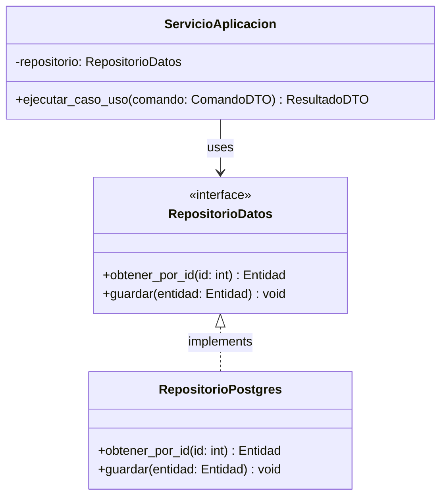
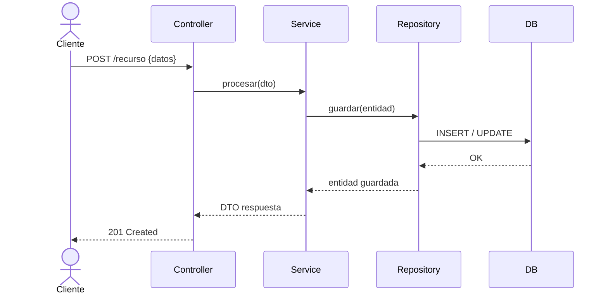

# Skill 02 — Arquitectura y Patrones de Software
**Fase PDCO**: PLAN → DEVELOPMENT | **SDLC Stage**: Design

---

## Propósito

Diseñar la arquitectura del sistema, seleccionar los patrones de diseño apropiados, modelar los componentes mediante diagramas UML y documentar todas las decisiones arquitectónicas siguiendo el **SWEBOK** (Capítulo 2: Software Design) y los principios **SOLID**.

---

## Workflow de Ejecución

```
ENTRADA: requirements.md + entity-map.md (de Skill 01)
    │
    ▼
[1] SELECCIÓN DE ESTILO ARQUITECTÓNICO
    │   Monolítico / Microservicios / Hexagonal / MVC / CQRS / Event-Driven
    │   Justificación basada en RNF
    │
    ▼
[2] DISEÑO DE CAPAS Y COMPONENTES
    │   Presentación / Aplicación / Dominio / Infraestructura
    │   Interfaces entre capas
    │
    ▼
[3] SELECCIÓN DE PATRONES GoF / GRASP
    │   Por cada problema de diseño → patrón apropiado
    │   Justificación explícita
    │
    ▼
[4] VALIDACIÓN SOLID
    │   Cada componente pasa el checklist SOLID
    │   Identificación y eliminación de antipatrones
    │
    ▼
[5] DIAGRAMACIÓN UML COMPLETA
    │   Clases / Secuencia / Componentes / Despliegue
    │   Diagrama de Comunicación
    │
    ▼
[6] ADR — Architecture Decision Records
    │
    ▼
SALIDA: architecture.md + patterns.md + diagrams/ + ADR/
```

---

## Estilos Arquitectónicos — Guía de Selección

| Estilo | Cuándo usarlo | Complejidad |
|--------|--------------|-------------|
| **MVC** | Apps web simples-medianas | Baja |
| **Hexagonal (Ports & Adapters)** | Alta testabilidad, desacoplamiento de frameworks/DB | Media |
| **Microservicios** | Escala independiente por dominio y equipos distribuidos | Alta |
| **CQRS** | Modelos de lectura y escritura altamente asimétricos | Alta |
| **Event-Driven** | Desacoplamiento temporal y espacial, streaming y eventos | Alta |
| **Layered** | Aplicaciones empresariales estándar | Media |

---

## Catálogo de Patrones — Selección por Problema

### GoF Creacionales
```
¿Necesitas una sola instancia global controlada? → Singleton
¿Crear objetos sin acoplar la clase concreta? → Factory Method
¿Familias de objetos relacionados o dependientes? → Abstract Factory
¿Construcción de objetos complejos paso a paso? → Builder
¿Clonar objetos existentes eficientemente? → Prototype
```

### GoF Estructurales
```
¿Adaptar una interfaz incompatible a lo que espera el cliente? → Adapter
¿Agregar responsabilidades a objetos dinámicamente? → Decorator
¿Simplificar la interacción con un subsistema complejo? → Facade
¿Estructuras jerárquicas árbol parte-todo? → Composite
¿Controlar acceso, lazy loading o seguridad a un objeto? → Proxy
¿Desacoplar una abstracción de su implementación? → Bridge
```

### GoF Comportamiento
```
¿Notificar cambios a múltiples suscriptores? → Observer
¿Algoritmos o estrategias intercambiables en tiempo de ejecución? → Strategy
¿Cadena de handlers procesadores independientes? → Chain of Responsibility
¿Encapsular peticiones/acciones como objetos independientes? → Command
¿Comportamiento que varía según el estado interno? → State
¿Esqueleto de algoritmo con pasos sobreescribibles? → Template Method
¿Recorrer elementos de una colección sin exponer su estructura? → Iterator
¿Nuevas operaciones sobre jerarquías sin modificar clases? → Visitor
```

### GRASP
```
¿Quién tiene la información necesaria para realizar una tarea? → Information Expert
¿Quién debe responsabilizarse de crear instancias de X? → Creator
¿Quién maneja los eventos de entrada del sistema? → Controller
¿Cómo reducir dependencias e impacto al cambio? → Low Coupling + High Cohesion
¿Cómo proteger el sistema contra la inestabilidad de interfaces? → Protected Variations
```

---

## Validación SOLID por Componente

```markdown
### Clase/Componente: [Nombre]

- [ ] **S** - Single Responsibility: ¿Tiene una única razón para cambiar?
- [ ] **O** - Open/Closed: ¿Está abierto a extensión pero cerrado a modificación?
- [ ] **L** - Liskov Substitution: ¿Las subclases pueden sustituir a sus clases base sin alterar el comportamiento?
- [ ] **I** - Interface Segregation: ¿Las interfaces son pequeñas, específicas y cohesivas?
- [ ] **D** - Dependency Inversion: ¿Depende de abstracciones (interfaces/protocolos) y no de implementaciones concretas?

**Violaciones encontradas**: [Ninguna | Describir]
**Corrección propuesta**: [Refactorización aplicada]
```

---

## Antipatrones — Radar de Detección

```
⚠️ God Object: Clase que concentra demasiada lógica y responsabilidades
   → Solución: Separar usando SRP + Information Expert

⚠️ Spaghetti Code: Flujo inmanejable sin estructura clara
   → Solución: Modularizar con capas, Strategy y Template Method

⚠️ Golden Hammer: Forzar el uso de una herramienta o patrón inadecuado
   → Solución: Evaluar trade-offs según los requerimientos no funcionales

⚠️ Magic Numbers / Strings: Literales sin contexto en la lógica
   → Solución: Constantes descriptivas, Enums y Value Objects

⚠️ Anemic Domain Model: Entidades como simples bolsas de datos sin lógica
   → Solución: Rich Domain Model (DDD), colocar lógica donde residen los datos

⚠️ Lava Flow: Código legacy muerto que nadie comprende ni elimina
   → Solución: Deprecar con tests de regresión y refactorizar

⚠️ Hard Coding: Parámetros o rutas incrustados en el código fuente
   → Solución: Configuración desacoplada (variables de entorno, YAML, .env)
```

---

## Diagramas UML en Mermaid

### Diagrama de Clases


### Diagrama de Secuencia


---

## Checklist de Completitud

- [ ] Estilo arquitectónico seleccionado y justificado según RNF
- [ ] Capas y componentes definidos con límites e interfaces claras
- [ ] Patrones GoF y GRASP seleccionados con justificación
- [ ] Checklist SOLID verificado en cada componente
- [ ] Antipatrones revisados y descartados
- [ ] Diagramas UML generados en Mermaid (Clases, Secuencia, Componentes)
- [ ] `docs/02-architecture/architecture.md` creado
- [ ] `docs/02-architecture/patterns.md` creado
- [ ] Mínimo 1 ADR documentado en `docs/02-architecture/ADR/`
- [ ] `metadata.json` actualizado con `"active_skill": "02-architecture"`
