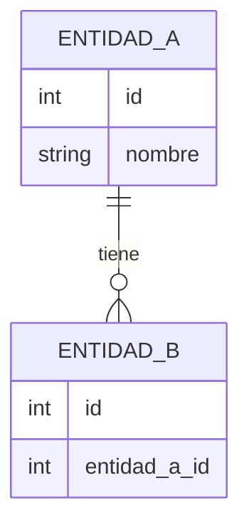
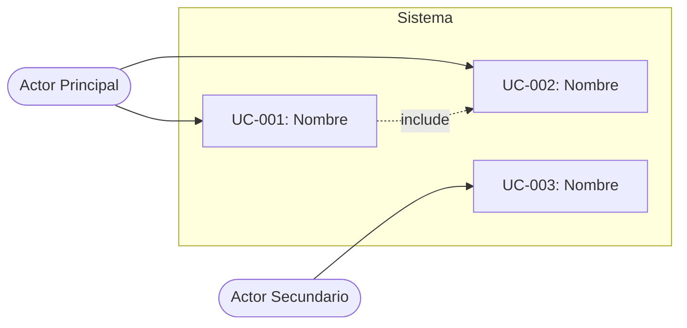
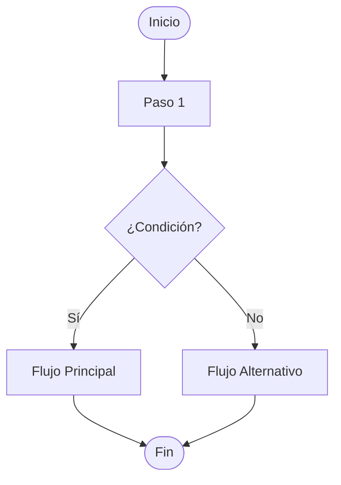

# Skill 01 — Análisis de Requerimientos
**Fase PDCO**: PLAN | **SDLC Stage**: Requirements

---

## Propósito

Esta skill convierte una necesidad o problema de negocio/datos en una especificación de requerimientos formal, trazable y documentada, siguiendo **IEEE 830 / ISO 29148** y las guías del **SWEBOK** (Capítulo 1: Software Requirements) y **DAMA-BOK**.

---

## Workflow de Ejecución

```
ENTRADA: Descripción del problema / necesidad del usuario
    │
    ▼
[1] SEGMENTACIÓN DEL PROBLEMA
    │   ¿Qué problema resuelve?
    │   ¿Cuál es el dominio?
    │   ¿Quiénes son los stakeholders?
    │
    ▼
[2] IDENTIFICACIÓN DE ENTIDADES
    │   Sustantivos clave → Entidades candidatas
    │   Relaciones entre entidades
    │   Atributos principales
    │
    ▼
[3] DEFINICIÓN DE CASOS DE USO
    │   Use Cases by Entity
    │   Actores primarios y secundarios
    │   Flujos principales y alternativos
    │
    ▼
[4] ESPECIFICACIÓN DE REQUERIMIENTOS
    │   Funcionales (RF-XXX)
    │   No funcionales (RNF-XXX)
    │   Restricciones (R-XXX)
    │
    ▼
[5] DIAGRAMACIÓN UML
    │   Diagrama de Casos de Uso
    │   Diagrama de Actividad (flujo principal)
    │   Diagrama de Estados (si aplica)
    │
    ▼
SALIDA: requirements.md + use-cases.md + entity-map.md + diagramas Mermaid
```

---

## Plantilla: Segmentación del Problema

```markdown
## Definición del Problema

### ¿Qué problema resuelve?
[Descripción del dolor o necesidad del negocio]

### ¿Cómo lo resuelve?
[Solución propuesta en alto nivel]

### Dominio del problema
[Área: finanzas / salud / educación / logística / territorio / etc.]

### Stakeholders
| Rol | Interés | Nivel de Influencia |
|-----|---------|---------------------|
| ... | ...     | Alto / Medio / Bajo |
```

---

## Plantilla: Mapa de Entidades

```markdown
## Entidades del Sistema

### Entidad: [NombreEntidad]
- **Descripción**: ...
- **Atributos clave**: id, nombre, fecha_creacion, ...
- **Relaciones**: 
  - tiene muchos [OtraEntidad]
  - pertenece a [OtraEntidad]
- **Use Cases asociados**: UC-001, UC-002

### Diagrama ER (Mermaid)

```

---

## Plantilla: Use Cases by Entity

```markdown
## Casos de Uso por Entidad

### Entidad: [NombreEntidad]

#### UC-001: [Nombre del caso de uso]
- **Actor**: [Quién lo ejecuta]
- **Precondición**: [Estado previo requerido]
- **Flujo Principal**:
  1. El actor hace X
  2. El sistema responde con Y
  3. ...
- **Flujo Alternativo** (FA-1): Si X falla → ...
- **Postcondición**: [Estado resultante]
- **Requerimientos relacionados**: RF-001, RNF-002
```

---

## Plantilla: Especificación de Requerimientos (requirements.md)

```markdown
# Especificación de Requerimientos de Software
**Proyecto**: [Nombre]  
**Versión**: 1.0  
**Fecha**: YYYY-MM-DD  
**Fase PDCO**: PLAN  
**Estándar**: IEEE 830 / ISO 29148  

---

## 1. Requerimientos Funcionales

| ID     | Descripción | Prioridad | Entidad | UC |
|--------|-------------|-----------|---------|-----|
| RF-001 | El sistema debe... | Alta | Entidad | UC-001 |

## 2. Requerimientos No Funcionales

| ID      | Tipo | Descripción | Métrica |
|---------|------|-------------|---------|
| RNF-001 | Rendimiento | El sistema debe responder en < 200ms | Latencia P95 |
| RNF-002 | Seguridad | Autenticación JWT obligatoria | - |
| RNF-003 | Disponibilidad | 99.9% uptime | SLA |

## 3. Restricciones

| ID    | Descripción |
|-------|-------------|
| R-001 | Debe integrarse con sistema X existente |
| R-002 | Stack tecnológico: Python 3.11+ / Java 17+ |

## 4. Glosario
| Término | Definición |
|---------|-----------|
| ... | ... |
```

---

## Diagramas UML de esta fase

### Diagrama de Casos de Uso (Mermaid)


### Diagrama de Actividad — Flujo Principal


---

## Checklist de Completitud

Antes de cerrar esta skill, verifica:
- [ ] Problema segmentado en: qué resuelve / cómo / desde qué entidades
- [ ] Mapa de entidades con atributos y relaciones
- [ ] Casos de uso por entidad con flujos principal y alternativo
- [ ] Requerimientos funcionales numerados (RF-XXX)
- [ ] Requerimientos no funcionales (RNF-XXX) con métricas
- [ ] Restricciones documentadas (R-XXX)
- [ ] Diagrama de casos de uso generado en Mermaid
- [ ] Diagrama de actividad del flujo principal
- [ ] Glosario del dominio
- [ ] `docs/01-requirements/requirements.md` creado
- [ ] `docs/01-requirements/use-cases.md` creado
- [ ] `docs/01-requirements/entity-map.md` creado
- [ ] `metadata.json` actualizado con `"active_skill": "01-requirements"`
