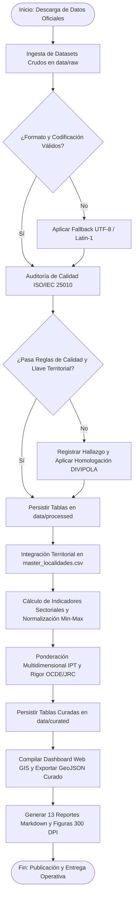

# Diagrama UML de Actividad — Pipeline de Datos SIPTA (v1.0.0)

```mermaid
flowchart TD
    A([Inicio: Descarga de Datos Oficiales]) --> B[Ingesta de Datasets Crudos en data/raw]
    B --> C{¿Formato y Codificación Válidos?}
    C -->|No| D[Aplicar Fallback UTF-8 / Latin-1]
    C -->|Sí| E[Auditoría de Calidad ISO/IEC 25010]
    D --> E
    E --> F{¿Pasa Reglas de Calidad y Llave Territorial?}
    F -->|No| G[Registrar Hallazgo y Aplicar Homologación DIVIPOLA]
    F -->|Sí| H[Persistir Tablas en data/processed]
    G --> H
    H --> I[Integración Territorial en master_localidades.csv]
    I --> J[Cálculo de Indicadores Sectoriales y Normalización Min-Max]
    J --> K[Ponderación Multidimensional IPT y Rigor OCDE/JRC]
    K --> L[Persistir Tablas Curadas en data/curated]
    L --> M[Compilar Dashboard Web GIS y Exportar GeoJSON Curado]
    M --> N[Generar 13 Reportes Markdown y Figuras 300 DPI]
    N --> O([Fin: Publicación y Entrega Operativa])
```
