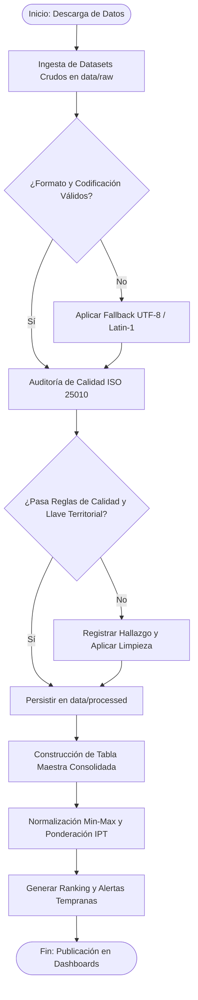

# Diagrama UML de Actividad — Pipeline de Datos SIPTA

```mermaid
flowchart TD
    A([Inicio: Descarga de Datos]) --> B[Ingesta de Datasets Crudos en data/raw]
    B --> C{¿Formato y Codificación Válidos?}
    C -->|No| D[Aplicar Fallback UTF-8 / Latin-1]
    C -->|Sí| E[Auditoría de Calidad ISO 25010]
    D --> E
    E --> F{¿Pasa Reglas de Calidad y Llave Territorial?}
    F -->|No| G[Registrar Hallazgo y Aplicar Limpieza]
    F -->|Sí| H[Persistir en data/processed]
    G --> H
    H --> I[Construcción de Tabla Maestra Consolidada]
    I --> J[Normalización Min-Max y Ponderación IPT]
    J --> K[Generar Ranking y Alertas Tempranas]
    K --> L([Fin: Publicación en Dashboards])
```
