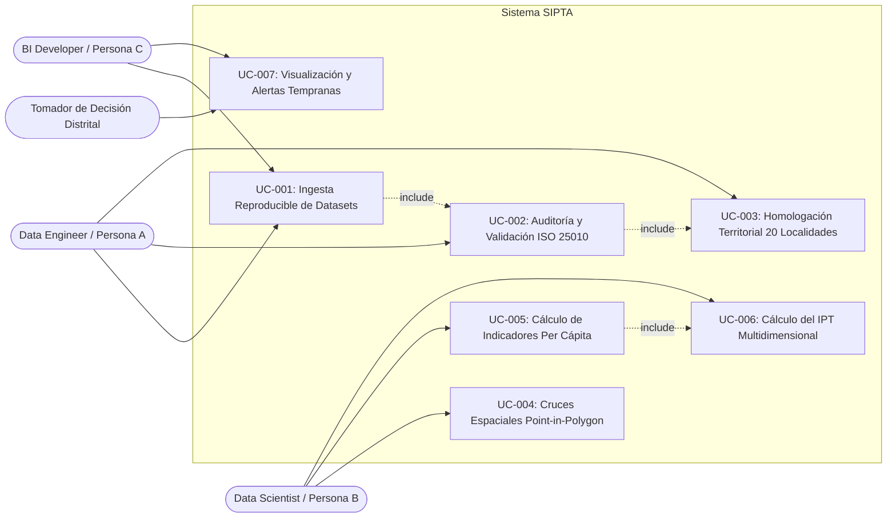

# Diagrama UML de Casos de Uso SIPTA

```mermaid
graph LR
    actor1([Data Engineer / Persona A])
    actor2([Data Scientist / Persona B])
    actor3([BI Developer / Persona C])
    actor4([Tomador de Decisión Distrital])

    subgraph Sistema SIPTA
        UC1[UC-001: Ingesta Reproducible de Datasets]
        UC2[UC-002: Auditoría y Validación ISO 25010]
        UC3[UC-003: Homologación Territorial 20 Localidades]
        UC4[UC-004: Cruces Espaciales Point-in-Polygon]
        UC5[UC-005: Cálculo de Indicadores Per Cápita]
        UC6[UC-006: Cálculo del IPT Multidimensional]
        UC7[UC-007: Visualización y Alertas Tempranas]
    end

    actor1 --> UC1
    actor1 --> UC2
    actor1 --> UC3
    actor2 --> UC4
    actor2 --> UC5
    actor2 --> UC6
    actor3 --> UC1
    actor3 --> UC7
    actor4 --> UC7
    UC1 -.->|include| UC2
    UC2 -.->|include| UC3
    UC5 -.->|include| UC6
```
