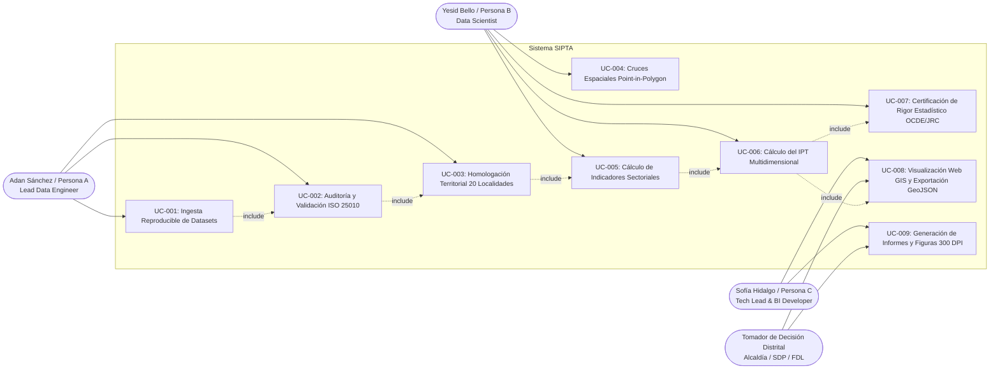

# Diagrama UML de Casos de Uso SIPTA (v1.0.0)

```mermaid
graph LR
    actor1([Adan Sánchez / Persona A<br/>Lead Data Engineer])
    actor2([Yesid Bello / Persona B<br/>Data Scientist])
    actor3([Sofía Hidalgo / Persona C<br/>Tech Lead & BI Developer])
    actor4([Tomador de Decisión Distrital<br/>Alcaldía / SDP / FDL])

    subgraph Sistema SIPTA
        UC1[UC-001: Ingesta Reproducible de Datasets]
        UC2[UC-002: Auditoría y Validación ISO 25010]
        UC3[UC-003: Homologación Territorial 20 Localidades]
        UC4[UC-004: Cruces Espaciales Point-in-Polygon]
        UC5[UC-005: Cálculo de Indicadores Sectoriales]
        UC6[UC-006: Cálculo del IPT Multidimensional]
        UC7[UC-007: Certificación de Rigor Estadístico OCDE/JRC]
        UC8[UC-008: Visualización Web GIS y Exportación GeoJSON]
        UC9[UC-009: Generación de Informes y Figuras 300 DPI]
    end

    actor1 --> UC1
    actor1 --> UC2
    actor1 --> UC3
    actor2 --> UC4
    actor2 --> UC5
    actor2 --> UC6
    actor2 --> UC7
    actor3 --> UC8
    actor3 --> UC9
    actor4 --> UC8
    actor4 --> UC9

    UC1 -.->|include| UC2
    UC2 -.->|include| UC3
    UC3 -.->|include| UC5
    UC5 -.->|include| UC6
    UC6 -.->|include| UC7
    UC6 -.->|include| UC8
```
