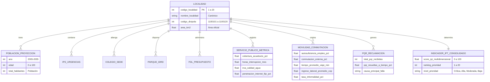

# Mapa de Entidades y Modelo de Dominio SIPTA

```mermaid
erDiagram
    LOCALIDAD ||--o{ POBLACION_PROYECCION : "tiene"
    LOCALIDAD ||--o{ IPS_URGENCIAS : "contiene"
    LOCALIDAD ||--o{ COLEGIO_SEDE : "alberga"
    LOCALIDAD ||--o{ PARQUE_IDRD : "dispone"
    LOCALIDAD ||--o{ FDL_PRESUPUESTO : "administra"
    LOCALIDAD ||--o{ SERVICIO_PUBLICO_METRICA : "registra"
    LOCALIDAD ||--o{ MOVILIDAD_CONMUTACION : "origina"
    LOCALIDAD ||--o{ PQR_RECLAMACION : "genera"
    LOCALIDAD ||--|| INDICADOR_IPT_CONSOLIDADO : "determina"

    LOCALIDAD {
        int codigo_localidad PK "1 a 20"
        string nombre_localidad "Canónico"
        int codigo_divipola "1100101 a 1100120"
        float area_km2 "Área oficial"
    }

    POBLACION_PROYECCION {
        int ano "2005-2035"
        int edad "0 a 100"
        int total_habitantes "Población"
    }

    SERVICIO_PUBLICO_METRICA {
        float cobertura_acueducto_pct
        float horas_interrupcion_mes
        float irca_calidad_agua
        float penetracion_internet_fijo_pct
    }

    MOVILIDAD_CONMUTACION {
        float autosuficiencia_empleo_pct
        float conmutacion_externa_pct
        float tiempo_promedio_viaje_min
        float ingreso_laboral_promedio_cop
        float tasa_informalidad_pct
    }

    PQR_RECLAMACION {
        int total_pqr_recibidas
        float pqr_resueltas_a_tiempo_pct
        string causa_principal_falla
    }

    INDICADOR_IPT_CONSOLIDADO {
        float score_ipt_multidimensional "0 a 100"
        int ranking_prioridad "1 a 20"
        string nivel_prioridad "Crítica, Alta, Moderada, Baja"
    }
```
