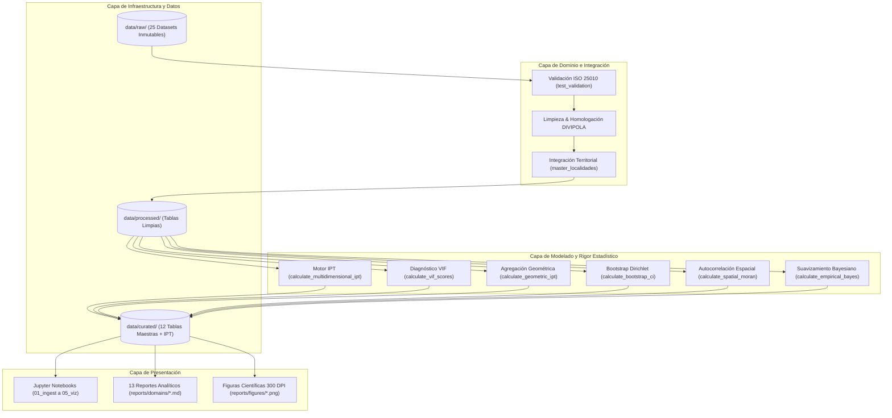
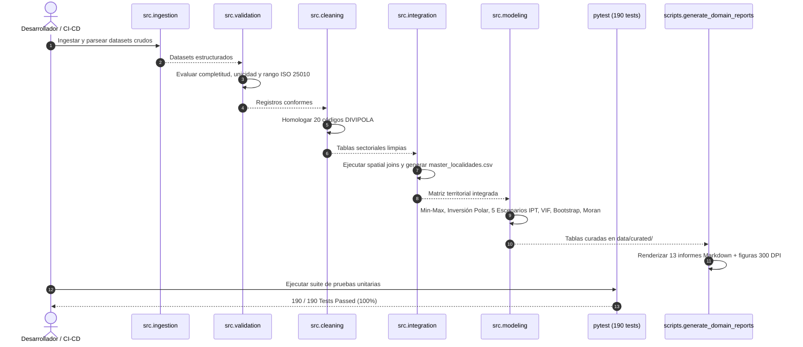

# Documento de Arquitectura de Software (SAD) — SIPTA (v2.6.0)

**Proyecto**: Sistema de Indicadores y Priorización Territorial y Alertas Tempranas (SIPTA)  
**Versión**: 2.6.0  
**Fecha de Actualización**: 2026-08-23  
**Fase PDCO**: PLAN → DEVELOPMENT | **SDLC Stage**: System Architecture & Design  
**Estilo Arquitectónico**: Arquitectura Hexagonal / Pipeline Modular por Capas + Motor de Auditoría Estadística  
**Estándares Rectores**: SWEBOK Cap. 2 (Software Design), DAMA-BOK, OECD/JRC, ISO/IEC 25010  
**Autores**: Persona A (Adan Sánchez), Persona B (Yesid Bello), Persona C (Sofía Hidalgo), Senior Software Engineer & Data Scientist Agent, Chief Statistical Reviewer  

---

## 1. Visión General del Sistema y Estilo Arquitectónico

SIPTA implementa una **Arquitectura Hexagonal (Ports & Adapters)** con un pipeline modular desacoplado en 5 capas:
1. **Capa de Infraestructura y Datos Crudos** (`data/raw/`): 25 datasets abiertos oficiales inmutables.
2. **Capa de Ingestión y Validación de Calidad** (`src/ingestion/`, `src/validation/`): Extracción y validación bajo ISO 25010.
3. **Capa de Dominio y Procesamiento Espacial** (`src/cleaning/`, `src/integration/`): Homologación DIVIPOLA y joins espaciales.
4. **Capa de Modelado y Auditoría Cuantitativa** (`src/modeling/`): Motor del IPT, cálculo de VIF, Agregación Geométrica, Remuestreo Bootstrap, Suavizamiento Bayesiano y Moran Espacial.
5. **Capa de Presentación y Consumo** (`notebooks/`, `reports/domains/`, `src/visualization/`): Cuadernos interactivos, reportes sectoriales Markdown y figuras a 300 DPI.

---

## 2. Diagramas UML de Arquitectura

### A. Diagrama de Componentes del Sistema

### B. Diagrama de Secuencia: Flujo de Ejecución del Pipeline Analítico

---

## 3. Matriz de Decisiones Arquitectónicas (ADR)

| ID | Decisión Arquitectónica | Alternativas Consideradas | Justificación Metodológica y Consecuencias |
|:---:|---|---|---|
| **ADR-001** | Arquitectura Hexagonal con Pipeline Modular en `src/` | Monolito exclusivo en Notebooks | **Aceptada**. Permite testabilidad automatizada con `pytest` (190 tests), modularidad y reusabilidad total en scripts y CLI. |
| **ADR-002** | Normalización Min-Max $[0, 1]$ con Inversión Polar | Estandarización Z-Score pura | **Aceptada**. Mantiene interpretabilidad para tomadores de decisión no técnicos en escala $[0, 100]$. Los *outliers* se mitigan en el Escenario 2 de Percentiles. |
| **ADR-003** | Unidad de Análisis Oficial: 20 Localidades Canónicas | Agregación a nivel UPZ / UPL / ZAT | **Aceptada**. Las localidades constituyen la unidad político-administrativa con asignación presupuestal directa (Fondos de Desarrollo Local FDL). |
| **ADR-004** | Incorporación de Agregación Geométrica No Compensatoria | Agregación exclusivamente aditiva | **Aceptada**. Cumple el estándar OCDE/JRC para penalizar desbalances críticos y verificar robustez institucional ($\rho = 0.962$). |
| **ADR-005** | Remuestreo Bootstrap Dirichlet ($B = 1.000$ réplicas) | Análisis de sensibilidad One-At-A-Time | **Aceptada**. Cuantifica la incertidumbre estocástica de los puntajes IPT e identifica intervalos de confianza al $95\%$. |

---

## 4. Validación de Principios SOLID en el Código

| Principio | Componente / Módulo | Implementación Concreta |
|:---:|---|---|
| **S** - Single Responsibility | `src.modeling.calculate_indicators` | Cada función realiza exclusivamente una operación matemática (e.g. `normalize_min_max`, `calculate_vif_scores`, `calculate_spatial_moran`). |
| **O** - Open/Closed | `src.modeling.domain_indicators` | El registro de dominios permite añadir nuevos sectores sin alterar la lógica de cálculo central del IPT. |
| **L** - Liskov Substitution | `src.validation.validators` | Las funciones validadoras respetan una firma uniforme `validate_dataframe(df) -> dict[str, Any]` intercambiable. |
| **I** - Interface Segregation | `src.visualization.plot_utils` | Funciones gráficas especializadas e independientes para barras, radares, dispersión y errores bootstrap. |
| **D** - Dependency Inversion | `src.integration.master_builder` | El constructor del tablón maestro recibe DataFrames desacoplados de los métodos de almacenamiento físico. |

---

## 5. Radar de Prevención de Antipatrones

- 🛡️ **No God Object**: El pipeline está fragmentado en módulos cohesivos (`ingestion`, `validation`, `cleaning`, `integration`, `modeling`, `visualization`).
- 🛡️ **No Magic Numbers**: Todas las constantes, factores de escala ($1.000$, $10.000$, $100.000$) y pesos canónicos ($1/7$) están formalmente parametrizados y documentados.
- 🛡️ **No Spaghetti Code**: Funciones puras con flujo de control lineal y control de excepciones explícito.
- 🛡️ **No Data Dredging ($p$-hacking)**: Las ponderaciones y dimensiones fueron fijadas formalmente en el marco conceptual antes de la estimación de sensibilidad.
