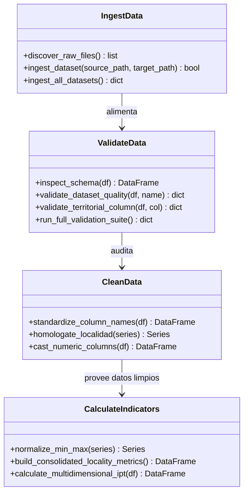

# Diagrama UML de Clases y Módulos SIPTA

```mermaid
classDiagram
    class IngestData {
        +discover_raw_files() list
        +ingest_dataset(source_path, target_path) bool
        +ingest_all_datasets() dict
    }

    class ValidateData {
        +inspect_schema(df) DataFrame
        +validate_dataset_quality(df, name) dict
        +validate_territorial_column(df, col) dict
        +run_full_validation_suite() dict
    }

    class CleanData {
        +standardize_column_names(df) DataFrame
        +homologate_localidad(series) Series
        +cast_numeric_columns(df) DataFrame
    }

    class CalculateIndicators {
        +normalize_min_max(series) Series
        +build_consolidated_locality_metrics() DataFrame
        +calculate_multidimensional_ipt(df) DataFrame
    }

    IngestData --> ValidateData : alimenta
    ValidateData --> CleanData : audita
    CleanData --> CalculateIndicators : provee datos limpios
```
