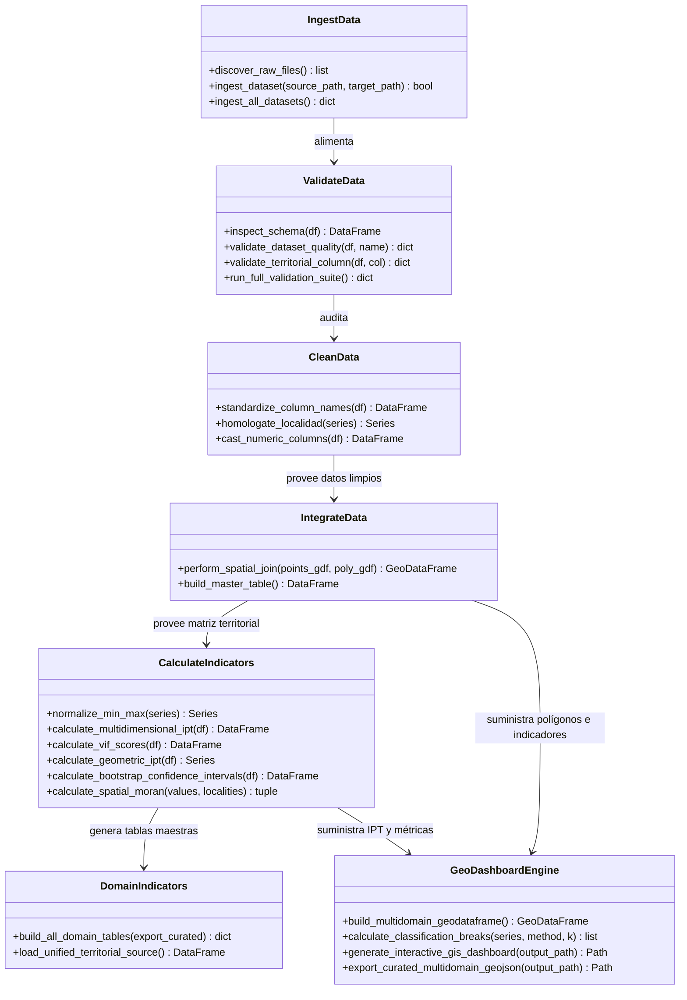

# Diagrama UML de Clases y Módulos SIPTA (v1.0.0)

```mermaid
classDiagram
    class IngestData {
        +discover_raw_files() list
        +ingest_dataset(source_path, target_path) bool
        +ingest_all_datasets() dict
    }

    class ValidateData {
        +inspect_schema(df) DataFrame
        +validate_dataset_quality(df, name) dict
        +validate_territorial_column(df, col) dict
        +run_full_validation_suite() dict
    }

    class CleanData {
        +standardize_column_names(df) DataFrame
        +homologate_localidad(series) Series
        +cast_numeric_columns(df) DataFrame
    }

    class IntegrateData {
        +perform_spatial_join(points_gdf, poly_gdf) GeoDataFrame
        +build_master_table() DataFrame
    }

    class CalculateIndicators {
        +normalize_min_max(series) Series
        +calculate_multidimensional_ipt(df) DataFrame
        +calculate_vif_scores(df) DataFrame
        +calculate_geometric_ipt(df) Series
        +calculate_bootstrap_confidence_intervals(df) DataFrame
        +calculate_spatial_moran(values, localities) tuple
    }

    class DomainIndicators {
        +build_all_domain_tables(export_curated) dict
        +load_unified_territorial_source() DataFrame
    }

    class GeoDashboardEngine {
        +build_multidomain_geodataframe() GeoDataFrame
        +calculate_classification_breaks(series, method, k) list
        +generate_interactive_gis_dashboard(output_path) Path
        +export_curated_multidomain_geojson(output_path) Path
    }

    IngestData --> ValidateData : alimenta
    ValidateData --> CleanData : audita
    CleanData --> IntegrateData : provee datos limpios
    IntegrateData --> CalculateIndicators : provee matriz territorial
    CalculateIndicators --> DomainIndicators : genera tablas maestras
    IntegrateData --> GeoDashboardEngine : suministra polígonos e indicadores
    CalculateIndicators --> GeoDashboardEngine : suministra IPT y métricas
```
