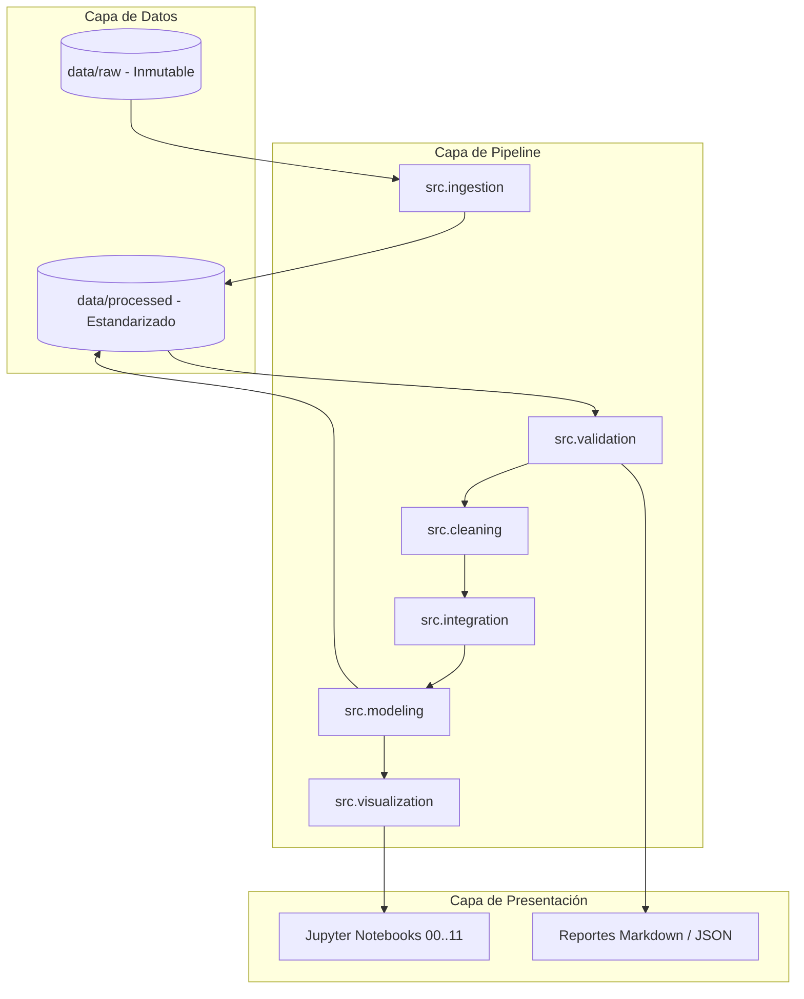

# Diagrama UML de Componentes SIPTA

```mermaid
graph TB
    subgraph Capa de Datos
        RAW[(data/raw - Inmutable)]
        PROC[(data/processed - Estandarizado)]
    end

    subgraph Capa de Pipeline
        ING[src.ingestion]
        VAL[src.validation]
        CLN[src.cleaning]
        INT[src.integration]
        MOD[src.modeling]
        VIZ[src.visualization]
    end

    subgraph Capa de Presentación
        NB[Jupyter Notebooks 00..11]
        REP[Reportes Markdown / JSON]
    end

    RAW --> ING
    ING --> PROC
    PROC --> VAL
    VAL --> CLN
    CLN --> INT
    INT --> MOD
    MOD --> VIZ
    MOD --> PROC
    VIZ --> NB
    VAL --> REP
```
