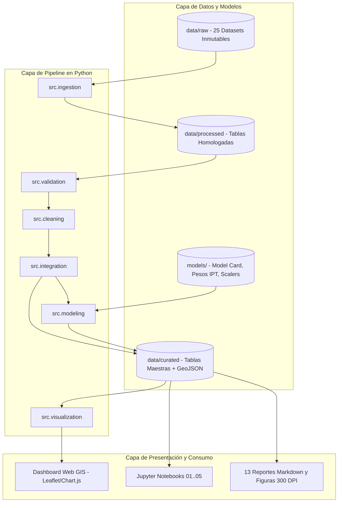

# Diagrama UML de Componentes SIPTA (v1.0.0)

```mermaid
graph TB
    subgraph Capa de Datos y Modelos
        RAW[(data/raw - 25 Datasets Inmutables)]
        PROC[(data/processed - Tablas Homologadas)]
        CUR[(data/curated - Tablas Maestras + GeoJSON)]
        MODELS[(models/ - Model Card, Pesos IPT, Scalers)]
    end

    subgraph Capa de Pipeline en Python
        ING[src.ingestion]
        VAL[src.validation]
        CLN[src.cleaning]
        INT[src.integration]
        MOD[src.modeling]
        VIZ[src.visualization]
    end

    subgraph Capa de Presentación y Consumo
        DASH[Dashboard Web GIS - Leaflet/Chart.js]
        NB[Jupyter Notebooks 01..05]
        REP[13 Reportes Markdown y Figuras 300 DPI]
    end

    RAW --> ING
    ING --> PROC
    PROC --> VAL
    VAL --> CLN
    CLN --> INT
    INT --> MOD
    MODELS --> MOD
    MOD --> CUR
    INT --> CUR
    CUR --> VIZ
    VIZ --> DASH
    CUR --> NB
    CUR --> REP
```
