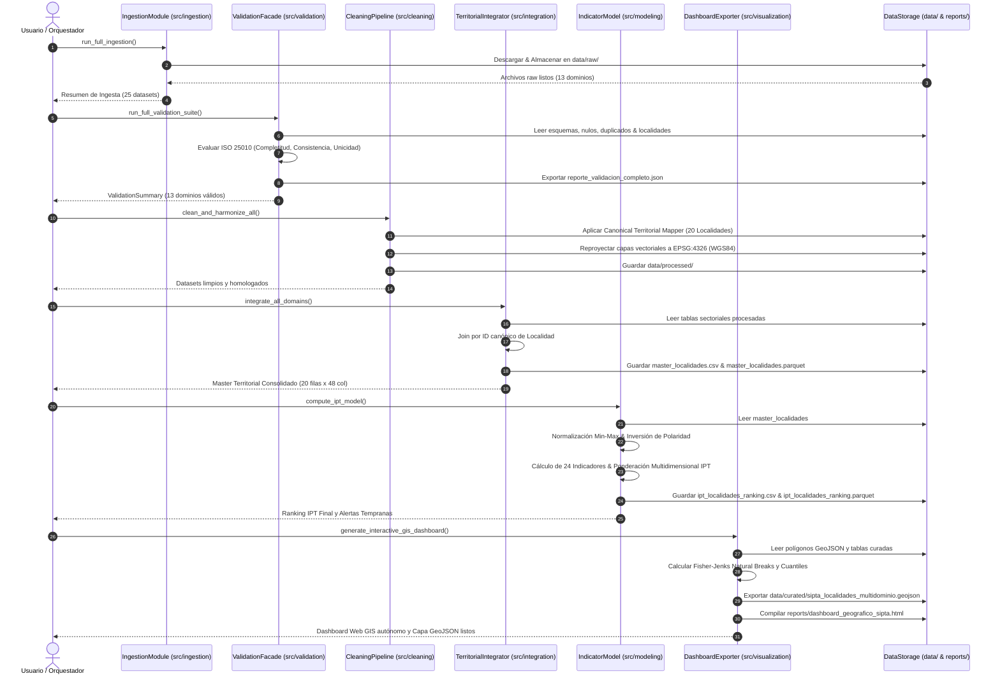

# Diagrama de Secuencia — Flujo Principal de Ejecución SIPTA
**Proyecto**: Sistema de Indicadores y Priorización Territorial y Alertas Tempranas  
**Fase PDCO**: DEVELOPMENT | **SDLC Stage**: System Design  
**Marco Normativo**: SWEBOK Cap. 2 (Software Design) / ISO/IEC 25010  

---

