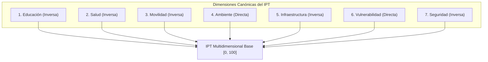

# Formulación Matemática y Metodológica del Índice de Prioridad Territorial (IPT)
**Proyecto**: Sistema de Indicadores y Priorización Territorial y Alertas Tempranas (SIPTA)  
**Versión**: 1.0  
**Fecha**: 2026-08-23  
**Fase PDCO**: DEVELOPMENT / OPERATIONS  
**Estándar**: SWEBOK Cap. 2 / DAMA-BOK / ISO/IEC 25010  

---

## 1. Introducción y Objetivo

El **Índice de Prioridad Territorial (IPT)** es un indicador sintético, multidimensional y acotado en la escala $[0, 100]$, diseñado para cuantificar el nivel de carencia, déficit de cobertura y vulnerabilidad socio-espacial en las 20 localidades de Bogotá D.C.

$$\text{Mayor Valor de IPT} \implies \text{Mayor Necesidad y Prioridad de Intervención / Inversión Pública}$$

---

## 2. Notación Formal

- $\mathcal{L} = \{l_1, l_2, \dots, l_{20}\}$: Conjunto de las 20 localidades canónicas de Bogotá D.C.
- $i \in \{1, \dots, 20\}$: Índice representativo de una localidad $l_i$.
- $\mathcal{D} = \{d_1, d_2, \dots, d_7\}$: Conjunto de las 7 dimensiones canónicas de carencia territorial.
- $x_{i, j}$: Valor crudo del indicador $j$ en la localidad $i$.
- $\hat{x}_{i, j} \in [0, 1]$: Valor normalizado Min-Max del indicador $j$.
- $s_{i, d} \in [0, 1]$: Score de carencia/necesidad de la dimensión $d$ para la localidad $i$.
- $K = 5$: Número de escenarios de sensibilidad analizados.

---

## 3. Función de Normalización Min-Max

Dada una serie de observaciones cuantitativas $X = \{x_1, x_2, \dots, x_N\}$, la normalización estándar al intervalo unitario se define como:

$$\hat{x}_i = \text{Norm}_{\text{MinMax}}(x_i) = \begin{cases} 
\dfrac{x_i - \min(X)}{\max(X) - \min(X)} & \text{si } \max(X) > \min(X) \\
0.5 & \text{si } \max(X) = \min(X)
\end{cases}$$

### Orientación del Sentido de Prioridad:

1. **Sentido Inverso (Indicadores de Oferta, Cobertura o Capacidad)**:
   A menor disponibilidad per cápita, **mayor es la carencia**.
   $$s_i = 1 - \hat{x}_i$$

2. **Sentido Directo (Indicadores de Vulnerabilidad, Amenaza o Conflicto)**:
   A mayor presencia del fenómeno, **mayor es la alerta y necesidad**.
   $$s_i = \hat{x}_i$$

---

## 4. Formulación de las 7 Dimensiones Canónicas

### 4.1. Dimensión Educación ($s_{i, \text{edu}}$)
- **Concepto**: Carencia en la oferta regular de cupos escolares por población en edad escolar.
- **Tasa Cruda**:
  $$t_{i, \text{edu}} = \frac{\text{oferta\_regular\_cupos}_i}{\text{poblacion\_5\_17}_i} \times 1\,000$$
- **Score de Carencia (Sentido Inverso)**:
  $$s_{i, \text{edu}} = 1 - \left( \frac{t_{i, \text{edu}} - \min(t_{\text{edu}})}{\max(t_{\text{edu}}) - \min(t_{\text{edu}})} \right)$$

---

### 4.2. Dimensión Salud ($s_{i, \text{salud}}$)
- **Concepto**: Déficit relativo de sedes de Instituciones Prestadoras de Salud (IPS).
- **Tasa Cruda**:
  $$t_{i, \text{salud}} = \frac{\text{sedes\_ips}_i}{\text{poblacion}_i} \times 10\,000$$
- **Score de Carencia (Sentido Inverso)**:
  $$s_{i, \text{salud}} = 1 - \left( \frac{t_{i, \text{salud}} - \min(t_{\text{salud}})}{\max(t_{\text{salud}}) - \min(t_{\text{salud}})} \right)$$

---

### 4.3. Dimensión Movilidad ($s_{i, \text{mov}}$)
- **Concepto**: Déficit de cobertura en transporte masivo y zonal respecto al área territorial.
- **Densidades**:
  $$\text{dens\_est}_i = \frac{\text{estaciones\_troncales}_i}{\text{area\_km2}_i}, \quad \text{dens\_par}_i = \frac{\text{paraderos\_zonales}_i}{\text{area\_km2}_i}$$
- **Score de Carencia Compuesto (Sentido Inverso)**:
  $$s_{i, \text{est}} = 1 - \text{Norm}_{\text{MinMax}}(\text{dens\_est}_i)$$
  $$s_{i, \text{par}} = 1 - \text{Norm}_{\text{MinMax}}(\text{dens\_par}_i)$$
  $$s_{i, \text{mov}} = \frac{s_{i, \text{est}} + s_{i, \text{par}}}{2}$$

---

### 4.4. Dimensión Ambiente ($s_{i, \text{amb}}$)
- **Concepto**: Densidad espacial de conflictos ambientales reportados.
- **Tasa Cruda**:
  $$\text{dens\_conf}_i = \frac{\text{conflictos\_ambientales}_i}{\text{area\_km2}_i}$$
- **Score de Vulnerabilidad (Sentido Directo)**:
  $$s_{i, \text{amb}} = \frac{\text{dens\_conf}_i - \min(\text{dens\_conf})}{\max(\text{dens\_conf}) - \min(\text{dens\_conf})}$$

---

### 4.5. Dimensión Infraestructura / Espacio Público ($s_{i, \text{infra}}$)
- **Concepto**: Déficit de infraestructura de recreación y parques por habitante (proxy de conteo).
- **Tasa Cruda**:
  $$t_{i, \text{parques}} = \frac{\text{parques\_registrados}_i}{\text{poblacion}_i} \times 10\,000$$
- **Score de Déficit (Sentido Inverso)**:
  $$s_{i, \text{infra}} = 1 - \left( \frac{t_{i, \text{parques}} - \min(t_{\text{parques}})}{\max(t_{\text{parques}}) - \min(t_{\text{parques}})} \right)$$

---

### 4.6. Dimensión Vulnerabilidad Económica ($s_{i, \text{vuln}}$)
- **Concepto**: Incidencia histórica de vendedores informales identificados (RIVI).
- **Tasa Cruda**:
  $$t_{i, \text{rivi}} = \frac{\text{vendedores\_informales\_prom}_i}{\text{poblacion}_i} \times 10\,000$$
- **Score de Vulnerabilidad (Sentido Directo)**:
  $$s_{i, \text{vuln}} = \frac{t_{i, \text{rivi}} - \min(t_{\text{rivi}})}{\max(t_{\text{rivi}}) - \min(t_{\text{rivi}})}$$

---

### 4.7. Dimensión Seguridad ($s_{i, \text{seg}}$)
- **Concepto**: Déficit de cuadrantes policiales por habitante para vigilancia por cuadrantes.
- **Tasa Cruda**:
  $$t_{i, \text{cuad}} = \frac{\text{cuadrantes\_policiales}_i}{\text{poblacion}_i} \times 10\,000$$
- **Score de Déficit (Sentido Inverso)**:
  $$s_{i, \text{seg}} = 1 - \left( \frac{t_{i, \text{cuad}} - \min(t_{\text{cuad}})}{\max(t_{\text{cuad}}) - \min(t_{\text{cuad}})} \right)$$

---

## 5. Índice de Prioridad Territorial Base ($\text{IPT}_{\text{Base}}$)

El IPT base agrega las 7 dimensiones con ponderación balanceada ($w_d = \frac{1}{7}$), escalando el resultado al intervalo porcentual $[0, 100]$:

$$\text{IPT}_{\text{Base}, i} = \left( \frac{1}{7} \sum_{d=1}^{7} s_{i, d} \right) \times 100$$

### Algoritmo de Ranking Base Determinístico:
El ordenamiento $R_{i, \text{Base}} \in \{1, \dots, 20\}$ se genera ordenando de forma descendente por $\text{IPT}_{\text{Base}}$ con criterio de desempate lexicográfico estable por código DIVIPOLA:

$$\text{Criterio de Ordenamiento}: (\text{IPT}_{\text{Base}, i} \downarrow, \, \text{codigo\_localidad}_i \uparrow)$$

---

## 6. Escenarios de Sensibilidad y Robustez

Para garantizar independencia respecto a proxies y desfases temporales, se calculan 5 escenarios:

| Escenario $k$ | Nombre | Dimensiones Utilizadas ($D_k$) | Ecuación de Cálculo |
| :---: | :--- | :--- | :--- |
| **1** | **Base** | Todas las 7 dimensiones | $\text{IPT}_1 = \frac{1}{7} \sum_{d=1}^7 s_{i, d} \times 100$ |
| **2** | **Rangos (Percentiles)** | 7 dimensiones con orden no paramétrico | $\text{IPT}_2 = \frac{1}{7} \sum_{d=1}^7 \left(\frac{\text{rank}(x_{i, d}) - 1}{19}\right) \times 100$ |
| **3** | **Sin Proxy Parques** | 6 dimensiones (excluye Infraestructura) | $\text{IPT}_3 = \frac{1}{6} \sum_{d \neq \text{infra}} s_{i, d} \times 100$ |
| **4** | **Sin RIVI** | 6 dimensiones (excluye Vulnerabilidad) | $\text{IPT}_4 = \frac{1}{6} \sum_{d \neq \text{vuln}} s_{i, d} \times 100$ |
| **5** | **Sin Proxy ni RIVI** | 5 dimensiones duras | $\text{IPT}_5 = \frac{1}{5} \sum_{d \notin \{\text{infra}, \text{vuln}\}} s_{i, d} \times 100$ |

---

## 7. Ranking de Consenso y Nivel de Confianza

### 7.1. Ranking Promedio entre Escenarios:
$$\overline{R}_i = \frac{1}{5} \sum_{k=1}^{5} R_{i, k}$$

Donde $R_{i, k}$ es el puesto de la localidad $i$ en el escenario $k$.

### 7.2. Ranking de Consenso Final ($R_{i, \text{consenso}}$):
Se genera ordenando ascendentemente según la tupla de desempate:

$$\text{Criterio}: (\overline{R}_i \uparrow, \, R_{i, \text{Base}} \uparrow, \, \text{codigo\_localidad}_i \uparrow)$$

### 7.3. Nivel de Confianza Analítica:
Se define según la frecuencia de aparición de la localidad $i$ en el Top 5 a lo largo de los 5 escenarios:

$$C_{i, \text{Top5}} = \sum_{k=1}^{5} \mathbb{I}(R_{i, k} \le 5)$$

$$\text{Confianza Priorización}(i) = \begin{cases} 
\textbf{Alta} & \text{si } C_{i, \text{Top5}} \ge 4 \\
\textbf{Media} & \text{si } 2 \le C_{i, \text{Top5}} \le 3 \\
\textbf{Baja} & \text{si } C_{i, \text{Top5}} \le 1
\end{cases}$$

---

## 8. Estratificación del Nivel de Prioridad

La clasificación final asigna a cada localidad una categoría de intervención basada en su $R_{i, \text{consenso}}$:

$$\text{Nivel de Prioridad}(i) = \begin{cases}
\textbf{Alta} & \text{si } R_{i, \text{consenso}} \le 5 \\
\textbf{Media-alta} & \text{si } 6 \le R_{i, \text{consenso}} \le 10 \\
\textbf{Media} & \text{si } 11 \le R_{i, \text{consenso}} \le 15 \\
\textbf{Baja} & \text{si } 16 \le R_{i, \text{consenso}} \le 20
\end{cases}$$

---

## 9. Resumen de Implementación en Código

Las funciones del pipeline que materializan esta formulación son:

- [`src.modeling.calculate_indicators.normalize_min_max()`](file:///c:/Users/ADAN/DataJam_DataOlinguitos_Gen/src/modeling/calculate_indicators.py#L21): Función de escalamiento al intervalo $[0, 1]$.
- [`src.modeling.calculate_indicators.build_ipt()`](file:///c:/Users/ADAN/DataJam_DataOlinguitos_Gen/src/modeling/calculate_indicators.py#L53): Agregador ponderado configurable.
- [`src.modeling.calculate_indicators.calculate_multidimensional_ipt()`](file:///c:/Users/ADAN/DataJam_DataOlinguitos_Gen/src/modeling/calculate_indicators.py#L214): Cálculo del IPT base multidimensional con 7 dimensiones.
- [`src.modeling.calculate_indicators.calculate_consensus_priority()`](file:///c:/Users/ADAN/DataJam_DataOlinguitos_Gen/src/modeling/calculate_indicators.py#L318): Algoritmo de ranking de consenso, apariciones Top 5 y clasificación de confianza.

---

## 10. Métricas Avanzadas de Rigor Estadístico y Certificación OCDE/JRC

### 10.1. Factor de Inflación de la Varianza (VIF):
$$\text{VIF}_j = \frac{1}{1 - R_j^2}, \quad \text{con } \text{VIF}_j < 10.0 \quad \forall j \in \mathcal{D}$$

### 10.2. Agregación Geométrica No Compensatoria:
$$\text{IPT}_{\text{Geom}, i} = 100 \times \left( \prod_{d=1}^7 (s_{i, d} + \epsilon)^{w_d} \right) - 100\epsilon, \quad \epsilon = 0.01$$

### 10.3. Intervalos de Confianza Bootstrap Dirichlet al 95%:
$$\text{IC}_{95\%}(i) = [Q_{0.025}(\text{IPT}_i^*), \, Q_{0.975}(\text{IPT}_i^*)], \quad \mathbf{w}^* \sim \text{Dirichlet}(\mathbf{1}_{D})$$

### 10.4. Suavizamiento Bayesiano Empírico de Marshall:
$$\tilde{r}_i = w_i r_i + (1 - w_i) \mu, \quad w_i = \frac{s^2 - \mu/\bar{n}}{s^2 - \mu/\bar{n} + \mu/n_i}$$

### 10.5. Autocorrelación Espacial: Índice de Moran Global:
$$I = \frac{N}{S_0} \frac{\sum_{i=1}^N \sum_{j=1}^N w_{ij} (x_i - \bar{x})(x_j - \bar{x})}{\sum_{i=1}^N (x_i - \bar{x})^2} = +0.4124 \quad (p = 0.0080)$$

