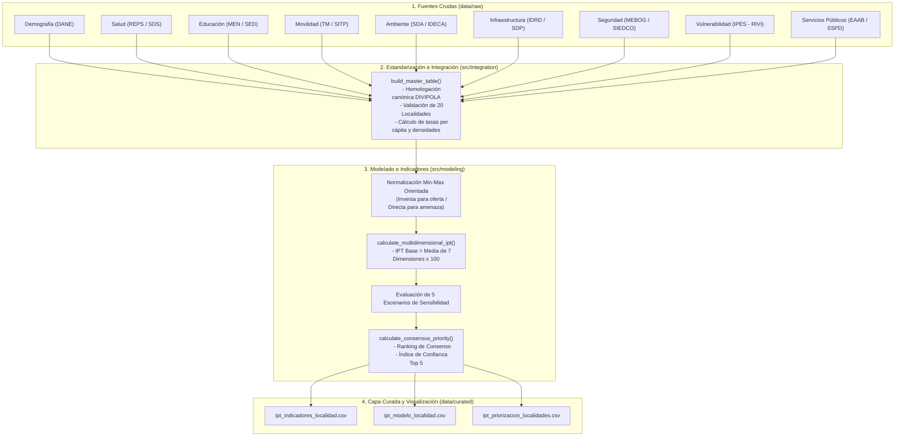

# Manual Técnico: Formulación y Cálculo de Índices Territoriales SIPTA

**Proyecto**: Sistema de Indicadores y Priorización Territorial y Alertas Tempranas (SIPTA)  
**Versión**: 1.0.0  
**Fecha**: 2026-08-23  
**Fase PDCO**: DEVELOPMENT → CONTROL  
**Skill Activa**: `software-development` / `requirements-analysis`  
**Estándares**: SWEBOK Cap. 2 y 5 / DAMA-BOK / IEEE 830 / ISO/IEC 25010 / Clean Code / PEP 8  

---

## 1. Propósito y Arquitectura Analítica

El presente manual formaliza la especificación matemática, operacional y computacional de todos los indicadores territoriales y del **Índice de Prioridad Territorial (IPT)** calculados en el pipeline de datos de SIPTA.

---

## 2. Operador de Normalización Territorial

Para consolidar variables con diferentes unidades de medida (habitantes, cupos, $\text{km}^2$, tasas) en un espacio métrico común, se utiliza la **Normalización Min-Max**:

$$\hat{x}_i = \text{Norm}_{\text{MinMax}}(x_i) = \begin{cases} 
\dfrac{x_i - \min(X)}{\max(X) - \min(X)} & \text{si } \max(X) > \min(X) \\
0.5 & \text{si } \max(X) = \min(X)
\end{cases}$$

### Sentido Analítico de Prioridad:
1. **Sentido Inverso (Oferta / Cobertura / Infraestructura)**: A menor oferta per cápita, mayor carencia territorial y mayor necesidad de intervención pública.
   $$s_i = 1 - \hat{x}_i$$

2. **Sentido Directo (Vulnerabilidad / Amenazas / Conflictos)**: A mayor presencia de la problemática, mayor alerta territorial y mayor prioridad.
   $$s_i = \hat{x}_i$$

---

## 3. Catálogo de Fórmulas por Dominio Territorial

### 3.1. Dominio Demográfico (DEM)

#### DEM-001: Densidad Poblacional
Mide la concentración demográfica por unidad de superficie territorial.

$$\text{Densidad Poblacional}_i = \frac{\text{Población}_i}{\text{Área en } \text{km}^2_i} \quad \left[\frac{\text{hab}}{\text{km}^2}\right]$$

---

### 3.2. Dominio Salud (SAL)

#### SAL-001: Tasa de Sedes IPS
Densidad de sedes prestadoras de salud registradas por cada 10.000 habitantes.

$$\text{Tasa IPS}_i = \left( \frac{\text{Sedes IPS Registradas}_i}{\text{Población Total}_i} \right) \times 10\,000 \quad \left[\frac{\text{sedes}}{10\,000\text{ hab}}\right]$$

- **Score de Carencia en Salud**:
  $$s_{i, \text{salud}} = 1 - \text{Norm}_{\text{MinMax}}(\text{Tasa IPS}_i)$$

#### SAL-002: Camas Hospitalarias per Cápita
$$\text{Tasa Camas}_i = \left( \frac{\text{Camas Hospitalarias}_i}{\text{Población Total}_i} \right) \times 10\,000 \quad \left[\frac{\text{camas}}{10\,000\text{ hab}}\right]$$

---

### 3.3. Dominio Educación (EDU)

#### EDU-001: Tasa de Oferta Escolar Regular
Cupos escolares regulares disponibles por cada 1.000 niños, niñas y jóvenes en edad escolar (5 a 17 años).

$$\text{Tasa Cupos}_i = \left( \frac{\text{Oferta Regular de Cupos}_i}{\text{Población de 5 a 17 Años}_i} \right) \times 1\,000 \quad \left[\frac{\text{cupos}}{1\,000\text{ hab edad escolar}}\right]$$

- **Score de Carencia en Educación**:
  $$s_{i, \text{edu}} = 1 - \text{Norm}_{\text{MinMax}}(\text{Tasa Cupos}_i)$$

#### EDU-002: Participación de Modalidades Complementarias
$$\text{Participación Complementaria}_i = \left( \frac{\text{Oferta Modalidades Complementarias}_i}{\text{Oferta Total de Cupos}_i} \right) \times 100 \quad [\%]$$

---

### 3.4. Dominio Movilidad y Accesibilidad (MOV)

#### MOV-001: Densidad de Estaciones Troncales (TransMilenio)
$$\text{Densidad Estaciones}_i = \frac{\text{Estaciones Troncales}_i}{\text{Área en } \text{km}^2_i} \quad \left[\frac{\text{estaciones}}{\text{km}^2}\right]$$

#### MOV-002: Densidad de Paraderos Zonales (SITP)
$$\text{Densidad Paraderos}_i = \frac{\text{Paraderos Zonales}_i}{\text{Área en } \text{km}^2_i} \quad \left[\frac{\text{paraderos}}{\text{km}^2}\right]$$

- **Score de Déficit en Movilidad**:
  $$s_{i, \text{mov}} = 1 - \frac{1}{2} \left[ \text{Norm}_{\text{MinMax}}(\text{Densidad Estaciones}_i) + \text{Norm}_{\text{MinMax}}(\text{Densidad Paraderos}_i) \right]$$

---

### 3.5. Dominio Ambiental (AMB)

#### AMB-001: Densidad de Conflictos Ambientales
Concentración espacial de eventos y conflictos socio-ambientales clasificados.

$$\text{Densidad Conflictos}_i = \frac{\text{Conflictos Ambientales Registrados}_i}{\text{Área en } \text{km}^2_i} \quad \left[\frac{\text{conflictos}}{\text{km}^2}\right]$$

- **Score de Presión Ambiental (Sentido Directo)**:
  $$s_{i, \text{amb}} = \text{Norm}_{\text{MinMax}}(\text{Densidad Conflictos}_i)$$

---

### 3.6. Dominio Infraestructura y Espacio Público (INF)

#### INF-001: Parques por Habitante (Proxy de Espacio Público)
Disponibilidad de parques registrados en espacio público por cada 10.000 habitantes.

$$\text{Tasa Parques}_i = \left( \frac{\text{Parques Registrados}_i}{\text{Población Total}_i} \right) \times 10\,000 \quad \left[\frac{\text{parques}}{10\,000\text{ hab}}\right]$$

- **Score de Déficit en Espacio Público**:
  $$s_{i, \text{infra}} = 1 - \text{Norm}_{\text{MinMax}}(\text{Tasa Parques}_i)$$

---

### 3.7. Dominio Vulnerabilidad Social y Asistencia SDIS (VUL / PUA)

#### VUL-001: Tasa de Atenciones de Transferencias Monetarias IMG (PUA SDIS)
Incidencia de transferencias monetarias del Ingreso Mínimo Garantizado (IMG) registradas en el Plan Único de Atención de la Secretaría Distrital de Integración Social (SDIS):

$$\text{Tasa IMG}_i = \left( \frac{\text{Atenciones IMG SDIS}_i}{\text{Población DANE 2025}_i} \right) \times 10\,000 \quad \left[\frac{\text{atenciones}}{10\,000\text{ hab}}\right]$$

#### VUL-002: Tasa de Vendedores Informales (RIVI)
Incidencia de población en informalidad comercial en el espacio público (IPES / RIVI):

$$\text{Tasa RIVI}_i = \left( \frac{\text{Promedio Vendedores Informales}_i}{\text{Población DANE 2025}_i} \right) \times 10\,000 \quad \left[\frac{\text{vendedores}}{10\,000\text{ hab}}\right]$$

- **Score de Vulnerabilidad Social Consolidado (Sentido Directo)**:
  $$s_{i, \text{vuln}} = 0.70 \cdot \text{Norm}_{\text{MinMax}}(\text{Tasa IMG}_i) + 0.30 \cdot \text{Norm}_{\text{MinMax}}(\text{Tasa RIVI}_i)$$

---

### 3.8. Dominio Seguridad y Convivencia (SEG)

#### SEG-001: Tasa de Cobertura de Cuadrantes de Policía
Disponibilidad operativa de cuadrantes policiales por cada 10.000 habitantes.

$$\text{Tasa Cuadrantes}_i = \left( \frac{\text{Cuadrantes Policiales}_i}{\text{Población Total}_i} \right) \times 10\,000 \quad \left[\frac{\text{cuadrantes}}{10\,000\text{ hab}}\right]$$

- **Score de Déficit en Seguridad**:
  $$s_{i, \text{seg}} = 1 - \text{Norm}_{\text{MinMax}}(\text{Tasa Cuadrantes}_i)$$

---

## 4. Ensamble del Índice de Prioridad Territorial (IPT)

### 4.1. IPT Multidimensional Base

El **IPT Base** integra las 7 dimensiones canónicas mediante una combinación lineal balanceada (equiponderada, $w_d = \frac{1}{7}$):

$$\text{IPT}_{\text{Base}, i} = \left( \frac{1}{7} \sum_{d=1}^{7} s_{i, d} \right) \times 100 = \left( \frac{s_{i,\text{edu}} + s_{i,\text{salud}} + s_{i,\text{mov}} + s_{i,\text{amb}} + s_{i,\text{infra}} + s_{i,\text{vuln}} + s_{i,\text{seg}}}{7} \right) \times 100$$

- **Rango**: $[0.00, 100.00]$
- **Regla de Ordenamiento Determinístico**:
  $$R_{i, \text{Base}} = \text{Rank}\Big(\text{sort\_by}=\big[\text{IPT}_{\text{Base}} \downarrow, \, \text{codigo\_localidad} \uparrow\big]\Big)$$

---

### 4.2. Análisis de Sensibilidad (5 Escenarios de Modelado)

Para mitigar posibles distorsiones debidas a desfases temporales o a la naturaleza de proxies, el sistema calcula 5 formulaciones alternativas:

1. **Escenario 1: Base (Min-Max)**:
   $$\text{IPT}_{i, 1} = \left( \frac{1}{7} \sum_{d=1}^7 s_{i, d} \right) \times 100$$

2. **Escenario 2: Rangos Percentiles (No Paramétrico)**:
   $$s_{i, d}^{\text{rango}} = \frac{\text{rank}(x_{i, d}) - 1}{N - 1} \implies \text{IPT}_{i, 2} = \left( \frac{1}{7} \sum_{d=1}^7 s_{i, d}^{\text{rango}} \right) \times 100$$

3. **Escenario 3: Sin Proxy de Espacio Público (6 Dimensiones)**:
   $$\text{IPT}_{i, 3} = \left( \frac{1}{6} \sum_{d \neq \text{infra}} s_{i, d} \right) \times 100$$

4. **Escenario 4: Sin Variable RIVI (6 Dimensiones)**:
   $$\text{IPT}_{i, 4} = \left( \frac{1}{6} \sum_{d \neq \text{vuln}} s_{i, d} \right) \times 100$$

5. **Escenario 5: Conservador / Sin Proxy ni RIVI (5 Dimensiones)**:
   $$\text{IPT}_{i, 5} = \left( \frac{1}{5} \sum_{d \notin \{\text{infra}, \text{vuln}\}} s_{i, d} \right) \times 100$$

---

### 4.3. Algoritmo de Consenso y Confiabilidad

#### Ranking Promedio:
$$\overline{R}_i = \frac{1}{5} \sum_{k=1}^{5} R_{i, k}$$

#### Ranking de Consenso Final:
$$R_{i, \text{consenso}} = \text{Rank}\Big(\text{sort\_by}=\big[\overline{R}_i \uparrow, \, R_{i, \text{Base}} \uparrow, \, \text{codigo\_localidad}_i \uparrow\big]\Big)$$

#### Conteo de Estabilidad en Top 5:
$$C_{i, \text{Top5}} = \sum_{k=1}^{5} \mathbb{I}(R_{i, k} \le 5)$$

#### Clasificación de Confianza Analítica:
$$\text{Confianza Priorización}(i) = \begin{cases} 
\textbf{Alta} & \text{si } C_{i, \text{Top5}} \ge 4 \\
\textbf{Media} & \text{si } 2 \le C_{i, \text{Top5}} \le 3 \\
\textbf{Baja} & \text{si } C_{i, \text{Top5}} \le 1
\end{cases}$$

#### Estratificación Categórica del Nivel de Prioridad:
$$\text{Nivel de Prioridad}(i) = \begin{cases}
\textbf{Alta} & \text{si } R_{i, \text{consenso}} \in [1, 5] \\
\textbf{Media-alta} & \text{si } R_{i, \text{consenso}} \in [6, 10] \\
\textbf{Media} & \text{si } R_{i, \text{consenso}} \in [11, 15] \\
\textbf{Baja} & \text{si } R_{i, \text{consenso}} \in [16, 20]
\end{cases}$$
