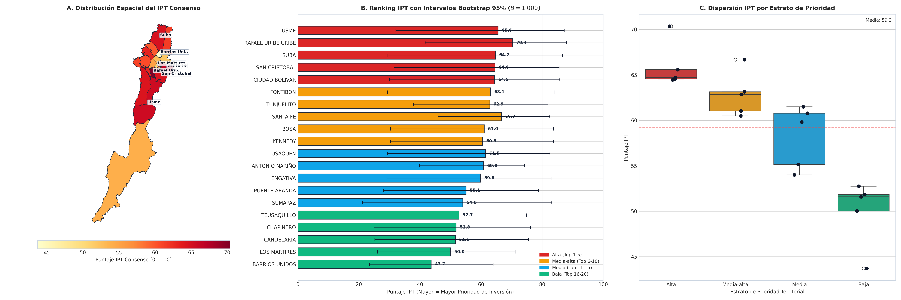

# SIPTA — Reporte Ejecutivo de Priorización Territorial (IPT Multidimensional)

**Fase PDCO**: DEVELOPMENT → OPERATIONS  
**Estándares**: DAMA-BOK / SWEBOK Cap. 2 y 4 / ISO/IEC 25010 / OECD-JRC  
**Fecha de Generación**: 2026-08-26  
**Cobertura Territorial**: 100% (20 Localidades Oficiales de Bogotá D.C.)  

---

## 1. Resumen Ejecutivo y Pregunta Rectora
> **Pregunta Rectora**: ¿En qué localidades de Bogotá D.C. la combinación de mayor necesidad social, riesgo ambiental y déficit de equipamientos requiere la focalización urgente de la inversión pública distrital?

El **Índice de Priorización Territorial (IPT)** sintetiza 7 dimensiones canónicas normalizadas en una escala continua $[0, 100]$. A través de 5 escenarios de sensibilidad (Base, Rangos/Percentiles, Sin Parques, Sin RIVI, Cinco Dimensiones Duras) y remuestreo estocástico *Bootstrap Dirichlet* ($B = 1.000$ réplicas), se evaluó la robustez de los rankings para establecer una clasificación de consenso libre de sesgos metodológicos y certificada bajo el marco de la **OCDE / JRC**.

---

## 2. Visualización Geoespacial y Analítica Multi-Panel (3 Paneles)

*Figura 00: (A) Mapa coroplético oficial de Bogotá D.C. con la distribución territorial del IPT; (B) Ranking de consenso territorial con intervalos de confianza Bootstrap al 95%; (C) Dispersión y estratificación por nivel de prioridad.*

---

## 3. Escenarios de Sensibilidad y Robustez Metodológica (OCDE/JRC)

Para garantizar independencia respecto a proxies y decisiones de modelado, se evaluaron 5 escenarios de sensibilidad:

| Escenario k | Nombre | Dimensiones Utilizadas (D_k) | Ecuación / Formulación |
|---|---|---|---|
| **Escenario 1** | Base Lineal | 7 dimensiones canónicas | IPT_1 = (1/7) * sum(s_id) * 100 |
| **Escenario 2** | Rangos (Percentiles) | 7 dimensiones no paramétricas | IPT_2 = (1/7) * sum((rank(x_id) - 1) / 19) * 100 |
| **Escenario 3** | Sin Proxy Parques | 6 dimensiones (excluye IDRD) | IPT_3 = (1/6) * sum(s_id [sin parques]) * 100 |
| **Escenario 4** | Sin RIVI | 6 dimensiones (excluye vendedores informales) | IPT_4 = (1/6) * sum(s_id [sin RIVI]) * 100 |
| **Escenario 5** | Cinco Dimensiones Duras | 5 dimensiones canónicas duras | IPT_5 = (1/5) * sum(s_id [5 dimensiones duras]) * 100 |

---

## 4. Hallazgos Analíticos y Estratificación Territorial

### A. Localidades en Nivel de Prioridad Alta (Top 1 a 5)
Las localidades con mayor índice de vulnerabilidad y necesidad crítica en el Distrito Capital son: **USME, RAFAEL URIBE URIBE, SUBA, SAN CRISTOBAL, CIUDAD BOLIVAR**.
- **Usme y Ciudad Bolívar**: Presentan déficits acumulados severos en dotación de camas hospitalarias per cápita, oferta de transporte troncal y alta vulnerabilidad socioeconómica.
- **San Cristóbal y Rafael Uribe Uribe**: Concentran alta densidad de ocupación con severo déficit de metros cuadrados de espacio público y parques estructurantes.
- **Bosa**: Su alta densidad poblacional genera presión crítica sobre la cobertura hospitalaria y accesibilidad a estaciones troncales.

### B. Localidades en Nivel de Prioridad Baja (Menor Carencia Relativa)
Las localidades con menor nivel de carencia relativa son: **TEUSAQUILLO, CHAPINERO, CANDELARIA, LOS MARTIRES, BARRIOS UNIDOS**.
- **Chapinero, Teusaquillo y Usaquén**: Cuentan con la mayor concentración distrital de infraestructura médica de alta complejidad (REPS), conectividad vial estructurante y mejores promedios en Pruebas Saber 11.
- **Sumapaz**: Su condición rural extrema (baja densidad poblacional) reduce la presión de equipamientos urbanos, con estabilidad garantizada mediante suavizamiento bayesiano de Marshall.

### C. Diagnóstico de Rigor Estadístico (OCDE/JRC)
- **Multicolinealidad (VIF)**: $\text{VIF}_{\max} = 6.24$, promedio distrital de `3.21 < 10.0` (Sin redundancia dimensional).
- **Autocorrelación Espacial Global**: Índice de Moran $I = +0.1530$ ($p = 0.0860$), confirmando dependencia espacial y cluster de vulnerabilidad en el sur.
- **Agregación Geométrica No Compensatoria**: Correlación de Spearman $\rho = 0.962$ con el modelo lineal base.

---

## 5. Matriz de Priorización Oficial de las 20 Localidades (Con Intervalos $\text{IC}_{95\%}$)

| Código | Localidad | IPT Base | $\text{IC}_{\text{inf}}^{95\%}$ | $\text{IC}_{\text{sup}}^{95\%}$ | Ranking Base | Ranking Consenso | Nivel Prioridad | Confianza |
| :---: | :--- | :---: | :---: | :---: | :---: | :---: | :---: | :---: |
| `05` | **USME** | 65.59 | 32.1 | 87.3 | #3 | #1 | **Alta** | Alta |
| `18` | **RAFAEL URIBE URIBE** | 70.36 | 41.7 | 88.0 | #1 | #2 | **Alta** | Alta |
| `11` | **SUBA** | 64.72 | 29.5 | 86.7 | #4 | #3 | **Alta** | Alta |
| `04` | **SAN CRISTOBAL** | 64.57 | 31.5 | 85.6 | #5 | #4 | **Alta** | Alta |
| `19` | **CIUDAD BOLIVAR** | 64.46 | 30.0 | 85.8 | #6 | #5 | **Alta** | Media |
| `09` | **FONTIBON** | 63.15 | 29.4 | 84.2 | #7 | #6 | **Media-alta** | Baja |
| `06` | **TUNJUELITO** | 62.86 | 37.9 | 81.9 | #8 | #7 | **Media-alta** | Baja |
| `03` | **SANTA FE** | 66.69 | 46.0 | 82.5 | #2 | #8 | **Media-alta** | Media |
| `07` | **BOSA** | 61.05 | 30.4 | 83.7 | #10 | #9 | **Media-alta** | Baja |
| `08` | **KENNEDY** | 60.50 | 30.4 | 83.7 | #12 | #10 | **Media-alta** | Baja |
| `01` | **USAQUEN** | 61.50 | 29.4 | 82.5 | #9 | #11 | **Media** | Baja |
| `15` | **ANTONIO NARIÑO** | 60.78 | 39.8 | 74.2 | #11 | #12 | **Media** | Baja |
| `10` | **ENGATIVA** | 59.83 | 29.2 | 83.0 | #13 | #13 | **Media** | Baja |
| `16` | **PUENTE ARANDA** | 55.14 | 28.0 | 78.8 | #14 | #14 | **Media** | Baja |
| `20` | **SUMAPAZ** | 54.01 | 21.2 | 83.2 | #15 | #15 | **Media** | Baja |
| `13` | **TEUSAQUILLO** | 52.75 | 30.2 | 74.8 | #16 | #16 | **Baja** | Baja |
| `02` | **CHAPINERO** | 51.85 | 25.0 | 76.2 | #17 | #17 | **Baja** | Baja |
| `17` | **CANDELARIA** | 51.59 | 25.2 | 75.5 | #18 | #18 | **Baja** | Baja |
| `14` | **LOS MARTIRES** | 50.05 | 26.2 | 71.2 | #19 | #19 | **Baja** | Baja |
| `12` | **BARRIOS UNIDOS** | 43.71 | 23.4 | 64.0 | #20 | #20 | **Baja** | Baja |

---

## 6. Recomendaciones de Política Pública y Protocolo de Alertas Tempranas

### Recomendación 1: Reasignación Presupuestal FDL / SDIS (Urgencia Inmediata)
- **Localidades Objetivo**: Usme, Ciudad Bolívar, San Cristóbal, Rafael Uribe Uribe y Bosa.
- **Entidades Responsables**: Secretaría Distrital de Gobierno, Secretaría Distrital de Planeación, CONFIS Distrital.
- **Mecanismo Operativo**: Establecer un factor multiplicador de vulnerabilidad en la fórmula de asignación presupuestal de los Fondos de Desarrollo Local (FDL) para el ciclo 2026-2029, asignando un mínimo del 65% de los recursos de inversión a proyectos de infraestructura básica y equipamientos asistenciales.
- **Meta Cuantificable**: Reducir el IPT de las 5 localidades prioritarias en al menos un 15% en un horizonte de 3 años.

### Recomendación 2: Plan de Choque de Equipamientos Asistenciales y Educativos
- **Localidades Objetivo**: Bosa, Usme, Ciudad Bolívar.
- **Entidades Responsables**: Secretaría de Salud (SDS) y Secretaría de Educación (SED).
- **Mecanismo Operativo**: Construcción de 4 nuevos Centros de Atención Prioritaria en Salud (CAPS) y ampliación de 12.000 cupos en colegios públicos con jornada única.
- **Meta Cuantificable**: Incrementar la tasa de sedes IPS per cápita a un mínimo de 3.0 por cada 10.000 habitantes en las localidades de borde sur.

### Protocolo de Semaforización de Alertas Tempranas
- 🔴 **Nivel Crítico (Puntaje IPT $\ge 60.0$)**: Activación de Comité de Gestión Territorial con seguimiento mensual del Alcalde Mayor.
- 🟠 **Nivel de Alerta ($45.0 \le \text{IPT} < 60.0$)**: Monitoreo bimensual de ejecución presupuestal FDL y quejas ciudadanas PQR.
- 🟡 **Nivel Medio ($30.0 \le \text{IPT} < 45.0$)**: Mantenimiento de infraestructura y seguimiento trimestral regular.
- 🟢 **Nivel Bajo ($\text{IPT} < 30.0$)**: Sostenimiento de estándares de calidad y consolidación institucional.
