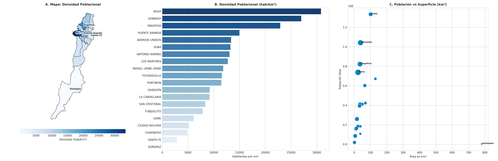

# SIPTA — Informe Analítico Sectorial: Demografía y Dinámica Espacial

**Fase PDCO**: DEVELOPMENT → OPERATIONS  
**Dominio**: Demografía y Dinámica Espacial  
**Estándares**: DAMA-BOK / SWEBOK Cap. 2 y 4 / ISO/IEC 25010  
**Fecha de Emisión**: 2026-08-26  
**Cobertura**: 100% (20 Localidades Oficiales de Bogotá D.C.)  
**Certificación de Calidad**: ISO/IEC 25010 Conforme (100% Completitud Territorial)  

---

## 1. Pregunta de Negocio y Resumen Ejecutivo
> **Pregunta Clave**: ¿Cómo se distribuye la concentración poblacional y la presión de ocupación sobre el territorio distrital?

El presente informe expone el comportamiento multidimensional de los indicadores de **Demografía y Dinámica Espacial** a lo largo de las 20 localidades del Distrito Capital, evaluando la distribución de capacidades, brechas estructurales, patrones geoespaciales y focos de intervención prioritaria.

---

## 2. Visualización Analítica y Geoespacial Multi-Panel (3 Paneles)

*Figura: (A) Mapa coroplético oficial de Bogotá D.C.; (B) Ranking y distribución territorial; (C) Dispersión bivariada y brechas estructurales.*

---

## 3. Catálogo de Indicadores Calculados del Dominio

| Código | Indicador | Fórmula Matemática | Unidad | Polaridad IPT | Fuente |
|---|---|---|---|:---:|---|
| `DEM-001` | **Densidad Poblacional** | $$\text{Densidad} = \frac{\text{Población}}{\text{Área km}^2}$$ | hab/km² | `Informativo / Divisor` | SDP / DANE |
| `DEM-002` | **Proyección Poblacional Total** | $$P_i = \sum \text{Habitantes Censados}$$ | Habitantes | `Denominador Per Cápita` | DANE Proyecciones |

---

## 4. Hallazgos Analíticos, Espaciales y Brechas Territoriales
- **Densidad Extrema en Borde Suroccidente**: Bosa (`28,842 hab/km²`) y Kennedy (`27,088 hab/km²`) presentan una concentración demográfica que triplica el promedio urbano de la capital, generando saturación extrema sobre vías, transporte y colegios.
- **Volumen Absoluto**: Suba (`1,232,535 hab`) y Kennedy (`1,091,115 hab`) concentran juntas más del 29% de toda la población de Bogotá D.C.
- **Contrastes de Ruralidad Extensa**: Sumapaz (`780.96 km²`, 45% del área distrital) registra apenas `18 hab/km²` y 3.678 habitantes, imponiendo desafíos logísticos de atención dispersa.

### 4.1. Diagnóstico Estadístico y Distribución Multivariada (DAMA-BOK)

| Variable / Indicador | Media (μ) | Mediana (Q2) | Desv. Est. (σ) | IQR | Mín | Máx | CV (%) | Asimetría (g1) |
|---|:---:|:---:|:---:|:---:|:---:|:---:|:---:|:---:|
| `poblacion` | 405,070.60 | 326,591.50 | 362,809.98 | 473,391.50 | 4,021.00 | 1,332,958.00 | 89.6% | +1.13 |
| `area_km2` | 76.03 | 35.88 | 169.00 | 36.62 | 2.06 | 780.96 | 222.3% | +4.22 |
| `densidad_poblacional` | 11,835.08 | 11,528.56 | 7,669.76 | 5,842.34 | 5.15 | 30,825.20 | 64.8% | +1.09 |

---

## 5. Tabla de Datos Oficiales de las 20 Localidades

| Código | Localidad | `poblacion` | `area_km2` | `densidad_poblacional` |
| :---: | :--- | :---: | :---: | :---: |
| `01` | **USAQUEN** | 602,412 | 65.31 | 9,223.89 |
| `02` | **CHAPINERO** | 184,757 | 38.00 | 4,862.03 |
| `03` | **SANTA FE** | 107,851 | 37.92 | 2,844.17 |
| `04` | **SAN CRISTOBAL** | 411,570 | 49.09 | 8,383.99 |
| `05` | **USME** | 422,489 | 69.13 | 6,111.51 |
| `06` | **TUNJUELITO** | 186,127 | 23.60 | 7,886.74 |
| `07` | **BOSA** | 737,647 | 23.93 | 30,825.20 |
| `08` | **KENNEDY** | 1,041,286 | 38.59 | 26,983.31 |
| `09` | **FONTIBON** | 411,638 | 35.88 | 11,472.63 |
| `10` | **ENGATIVA** | 822,369 | 35.88 | 22,919.98 |
| `11` | **SUBA** | 1,332,958 | 100.56 | 13,255.35 |
| `12` | **BARRIOS UNIDOS** | 159,163 | 11.90 | 13,375.04 |
| `13` | **TEUSAQUILLO** | 164,384 | 14.19 | 11,584.50 |
| `14` | **LOS MARTIRES** | 82,827 | 6.51 | 12,723.04 |
| `15` | **ANTONIO NARINO** | 86,119 | 6.59 | 13,068.13 |
| `16` | **PUENTE ARANDA** | 259,314 | 17.31 | 14,980.59 |
| `17` | **LA CANDELARIA** | 18,941 | 2.06 | 9,194.66 |
| `18` | **RAFAEL URIBE URIBE** | 393,869 | 33.28 | 11,835.01 |
| `19` | **CIUDAD BOLIVAR** | 671,670 | 130.00 | 5,166.69 |
| `20` | **SUMAPAZ** | 4,021 | 780.96 | 5.15 |

---

## 6. Recomendaciones de Política Pública y Alertas Tempranas

### A. Recomendación Estratégica Principal (Corto Plazo / Plan de Choque)
- **Localidades Críticas**: Bosa, Kennedy, Suba, Tunjuelito
- **Entidad Responsable**: Secretaría Distrital de Planeación (SDP) y Secretaría del Hábitat
- **Acción Operativa / Mecanismo**: Actualización del plan de equipamientos y reservas de suelo en bordes de expansión urbana para descongestionar el déficit de espacio por habitante.
- **Meta / Efecto Esperado**: Garantizar un estándar mínimo de 6.0 m² de espacio público efectivo por habitante en planes parciales.

### B. Recomendación de Sostenibilidad y Eficiencia (Mediano y Largo Plazo)
- **Alcance Distrital**: Localidades Rurales (Sumapaz, Usme Rural, Chapinero Rural)
- **Acción de Gestión**: Estructuración de brigadas móviles de servicios distritales adaptadas a la baja densidad.
- **Impacto Cuantificable**: Cobertura institucional del 100% en veredas rurales dispersas.

### C. Protocolo de Semaforización de Alertas Tempranas
- 🔴 **Alerta Crítica (Rojo)**: Densidad >= 25,000 hab/km² con déficit de equipamientos.
- 🟠 **Alerta Media (Naranja)**: Densidad entre 15,000 y 25,000 hab/km².
- 🟢 **Condición Estable (Verde)**: Densidad < 15,000 hab/km² con equilibrio de espacio.

---

## 7. Certificación de Calidad y Linaje DAMA-BOK / ISO 25010
- **Completitud Espacial**: 100.0% (20 de 20 localidades canónicas homologadas).
- **Consistencia de Tipos**: Tipado estático conforme y validado con `src.validation`.
- **Inmutabilidad de Fuentes**: Origen verificado en `data/raw/` y transformaciones deterministas sin pérdida de precisión.
