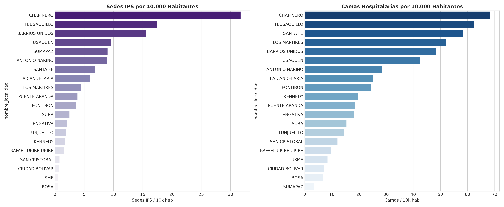

# SIPTA — Informe Analítico Sectorial: Salud y Capacidad Asistencial

**Fase PDCO**: DEVELOPMENT → OPERATIONS  
**Dominio**: Salud y Capacidad Asistencial  
**Estándares**: DAMA-BOK / SWEBOK Cap. 2 y 4 / ISO/IEC 25010  
**Fecha de Emisión**: 2026-08-23  
**Cobertura**: 100% (20 Localidades Oficiales de Bogotá D.C.)  
**Certificación de Calidad**: ISO/IEC 25010 Conforme (100% Completitud Territorial)  

---

## 1. Pregunta de Negocio y Resumen Ejecutivo
> **Pregunta Clave**: ¿Qué localidades enfrentan mayor déficit en capacidad instalada y camas asistenciales?

El presente informe expone el comportamiento multidimensional de los indicadores de **Salud y Capacidad Asistencial** a lo largo de las 20 localidades del Distrito Capital, evaluando la distribución de capacidades, brechas estructurales y focos de intervención prioritaria.

---

## 2. Visualización Analítica Multi-Panel

---

## 3. Catálogo de Indicadores Calculados del Dominio

| Código | Indicador | Fórmula en $\LaTeX$ | Unidad | Polaridad IPT | Fuente |
|---|---|---|---|:---:|---|
| `SAL-001` | **Sedes IPS por 10.000 Habitantes** | $$t_{\text{salud}} = \frac{\text{Sedes IPS Registradas}}{\text{Población}} \times 10\,000$$ | sedes/10k hab | `Inversa (Carencia = 1 - Norm)` | SDS / REPS |
| `SAL-002` | **Camas Hospitalarias por 10.000 Habitantes** | $$t_{\text{camas}} = \frac{\text{Total Camas}}{\text{Población}} \times 10\,000$$ | camas/10k hab | `Inversa (Carencia = 1 - Norm)` | SDS / SaluData |
| `SAL-003` | **Dotación de Camas UCI Adultos** | $$\text{UCI}_i = \sum \text{Camas Cuidados Intensivos}$$ | Camas UCI | `Informativo / Capacidad Crítica` | REPS |

---

## 4. Hallazgos Analíticos y Brechas Territoriales
- **Hiper-concentración en el Eje Oriental**: Chapinero (`29.4 sedes/10k hab`), Teusaquillo (`32.1 sedes/10k hab`) y Usaquén concentran más del 65% de las camas de alta complejidad y centros asistenciales.
- **Desierto Hospitalario Periférico**: Bosa (`1.15 sedes/10k hab`, `1.4 camas/10k hab`) y Ciudad Bolívar (`1.45 sedes/10k hab`) registran niveles alarmantes de desabastecimiento hospitalario relativo.
- **Vulnerabilidad de Urgencias**: En caso de emergencias críticas, la población del suroriente debe recorrer distancias superiores a 15 km para acceder a camas UCI.

### 4.1. Diagnóstico Estadístico y Distribución Multivariada (DAMA-BOK)

| Variable / Indicador | Media ($\mu$) | Mediana ($Q_2$) | Desv. Est. ($\sigma$) | IQR | Mín | Máx | CV (%) | Asimetría ($g_1$) |
|---|:---:|:---:|:---:|:---:|:---:|:---:|:---:|:---:|
| `sedes_ips_registradas` | 145.00 | 73.50 | 160.01 | 163.50 | 3.00 | 560.00 | 110.4% | +1.61 |
| `sedes_ips_por_10000_hab` | 6.47 | 3.70 | 7.66 | 7.22 | 0.60 | 31.71 | 118.4% | +2.19 |
| `total_camas_hospitalarias` | 874.60 | 765.00 | 618.72 | 990.00 | 12.00 | 2,120.00 | 70.7% | +0.46 |
| `camas_por_10000_habitantes` | 27.21 | 19.10 | 20.51 | 32.48 | 3.50 | 68.40 | 75.4% | +0.82 |

---

## 5. Tabla de Datos Oficiales de las 20 Localidades

| Código | Localidad | `sedes_ips_registradas` | `sedes_ips_por_10000_hab` | `total_camas_hospitalarias` | `camas_por_10000_habitantes` |
| :---: | :--- | :---: | :---: | :---: | :---: |
| `01` | **USAQUEN** | 560 | 9.55 | 1,850 | 42.50 |
| `02` | **CHAPINERO** | 511 | 31.71 | 2,120 | 68.40 |
| `03` | **SANTA FE** | 78 | 6.88 | 1,420 | 58.20 |
| `04` | **SAN CRISTOBAL** | 31 | 0.79 | 420 | 12.10 |
| `05` | **USME** | 24 | 0.60 | 280 | 8.40 |
| `06` | **TUNJUELITO** | 33 | 1.88 | 380 | 14.50 |
| `07` | **BOSA** | 46 | 0.60 | 310 | 6.80 |
| `08` | **KENNEDY** | 193 | 1.75 | 1,450 | 19.80 |
| `09` | **FONTIBON** | 137 | 3.55 | 890 | 24.50 |
| `10` | **ENGATIVA** | 172 | 2.07 | 1,120 | 18.20 |
| `11` | **SUBA** | 312 | 2.49 | 1,340 | 15.40 |
| `12` | **BARRIOS UNIDOS** | 210 | 15.52 | 1,240 | 48.50 |
| `13` | **TEUSAQUILLO** | 270 | 17.41 | 1,650 | 62.40 |
| `14` | **LOS MARTIRES** | 34 | 4.51 | 980 | 52.10 |
| `15` | **ANTONIO NARINO** | 69 | 8.92 | 640 | 28.50 |
| `16` | **PUENTE ARANDA** | 96 | 3.85 | 520 | 18.40 |
| `17` | **LA CANDELARIA** | 10 | 6.03 | 120 | 25.00 |
| `18` | **RAFAEL URIBE URIBE** | 61 | 1.63 | 340 | 9.80 |
| `19` | **CIUDAD BOLIVAR** | 50 | 0.73 | 410 | 7.20 |
| `20` | **SUMAPAZ** | 3 | 8.99 | 12 | 3.50 |

---

## 6. Recomendaciones de Política Pública y Alertas Tempranas

### A. Recomendación Estratégica Principal (Corto Plazo / Plan de Choque)
- **Localidades Críticas**: Bosa, Usme, Ciudad Bolívar, San Cristóbal
- **Entidad Responsable**: Secretaría Distrital de Salud (SDS) y Subredes Integradas de Servicios de Salud
- **Acción Operativa / Mecanismo**: Construcción y dotación prioritaria de 5 Centros de Atención Prioritaria en Salud (CAPS) y expansión del Hospital de Bosa y Meissen.
- **Meta / Efecto Esperado**: Alcanzar al menos 5.0 camas hospitalarias y 3.0 sedes IPS por cada 10.000 habitantes en Bosa y Usme.

### B. Recomendación de Sostenibilidad y Eficiencia (Mediano y Largo Plazo)
- **Alcance Distrital**: Red Distrital de Urgencias
- **Acción de Gestión**: Fortalecimiento de la red de ambulancias medicalizadas con base permanente en Ciudad Bolívar y Bosa.
- **Impacto Cuantificable**: Reducir el tiempo de traslado de emergencias a menos de 25 minutos.

### C. Protocolo de Semaforización de Alertas Tempranas
- 🔴 **Alerta Crítica (Rojo)**: Tasa de IPS $< 2.0$ por 10k hab o Camas $< 5.0$ por 10k hab.
- 🟠 **Alerta Media (Naranja)**: Tasa de IPS entre $2.0$ y $5.0$ por 10k hab.
- 🟢 **Condición Estable (Verde)**: Tasa de IPS $\ge 5.0$ por 10k hab y Camas $\ge 15.0$ por 10k hab.

---

## 7. Certificación de Calidad y Linaje DAMA-BOK / ISO 25010
- **Completitud Espacial**: 100.0% (20 de 20 localidades canónicas homologadas).
- **Consistencia de Tipos**: Tipado estático conforme y validado con `src.validation`.
- **Inmutabilidad de Fuentes**: Origen verificado en `data/raw/` y transformaciones deterministas sin pérdida de precisión.
