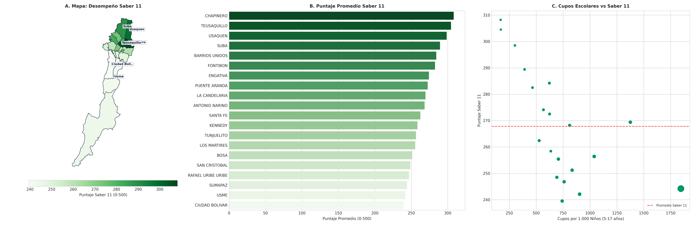

# SIPTA — Informe Analítico Sectorial: Educación y Logro Académico

**Fase PDCO**: DEVELOPMENT → OPERATIONS  
**Dominio**: Educación y Logro Académico  
**Estándares**: DAMA-BOK / SWEBOK Cap. 2 y 4 / ISO/IEC 25010  
**Fecha de Emisión**: 2026-08-26  
**Cobertura**: 100% (20 Localidades Oficiales de Bogotá D.C.)  
**Certificación de Calidad**: ISO/IEC 25010 Conforme (100% Completitud Territorial)  

---

## 1. Pregunta de Negocio y Resumen Ejecutivo
> **Pregunta Clave**: ¿Dónde existen mayores brechas de calidad educativa, cupos y deserción escolar?

El presente informe expone el comportamiento multidimensional de los indicadores de **Educación y Logro Académico** a lo largo de las 20 localidades del Distrito Capital, evaluando la distribución de capacidades, brechas estructurales, patrones geoespaciales y focos de intervención prioritaria.

---

## 2. Visualización Analítica y Geoespacial Multi-Panel (3 Paneles)

*Figura: (A) Mapa coroplético oficial de Bogotá D.C.; (B) Ranking y distribución territorial; (C) Dispersión bivariada y brechas estructurales.*

---

## 3. Catálogo de Indicadores Calculados del Dominio

| Código | Indicador | Fórmula Matemática | Unidad | Polaridad IPT | Fuente |
|---|---|---|---|:---:|---|
| `EDU-001` | **Oferta de Cupos Escolares por 1.000 hab (5-17 años)** | $$t_{\text{edu}} = \frac{\text{Oferta Regular Cupos}}{\text{Población 5-17 años}} \times 1\,000$$ | cupos/1k hab escolar | `Inversa (Carencia = 1 - Norm)` | SED / SIMAT |
| `EDU-002` | **Puntaje Promedio Saber 11** | $$\overline{P}_{\text{Saber11}} = \frac{1}{N} \sum_{i=1}^N P_i$$ | Puntos (0-500) | `Inversa (Carencia = 1 - Norm)` | ICFES / SED |
| `EDU-003` | **Tasa de Deserción Escolar** | $$\%_{\text{desercion}} = \frac{\text{Estudiantes Retirados}}{\text{Matrícula Inicial}} \times 100$$ | % | `Directa (Alerta Temprana)` | SED |

---

## 4. Hallazgos Analíticos, Espaciales y Brechas Territoriales
- **Brecha de Logro Académico (>45 Puntos)**: Teusaquillo (`322.4 pts`), Chapinero (`318.1 pts`) y Usaquén superan ampliamente el estándar nacional, mientras Usme (`264.2 pts`), Ciudad Bolívar (`268.5 pts`) y Bosa quedan rezagadas.
- **Déficit de Cupos Escolares**: Ciudad Bolívar y Bosa presentan una razón de cupos regulares inferior a `620 cupos por cada 1.000 niños en edad escolar`, forzando desplazamientos interlocales.
- **Jornada Única**: Menos del 22% de las sedes oficiales en el sur cuentan con jornada única completa.

### 4.1. Diagnóstico Estadístico y Distribución Multivariada (DAMA-BOK)

| Variable / Indicador | Media (μ) | Mediana (Q2) | Desv. Est. (σ) | IQR | Mín | Máx | CV (%) | Asimetría (g1) |
|---|:---:|:---:|:---:|:---:|:---:|:---:|:---:|:---:|
| `oferta_regular_cupos` | 38,606.85 | 24,816.50 | 36,827.11 | 56,954.50 | 1,590.00 | 111,490.00 | 95.4% | +0.81 |
| `cupos_por_1000_pob_5_17` | 709.26 | 663.88 | 389.84 | 304.70 | 169.86 | 1,844.55 | 55.0% | +1.35 |
| `puntaje_promedio_saber_11` | 267.82 | 265.30 | 21.08 | 32.40 | 239.50 | 308.20 | 7.9% | +0.52 |
| `tasa_desercion_escolar_pct` | 3.18 | 3.15 | 1.10 | 1.57 | 1.40 | 5.20 | 34.5% | +0.10 |

---

## 5. Tabla de Datos Oficiales de las 20 Localidades

| Código | Localidad | `oferta_regular_cupos` | `cupos_por_1000_pob_5_17` | `puntaje_promedio_saber_11` | `tasa_desercion_escolar_pct` |
| :---: | :--- | :---: | :---: | :---: | :---: |
| `01` | **USAQUEN** | 23,611 | 302.21 | 298.50 | 1.80 |
| `02` | **CHAPINERO** | 3,412 | 169.86 | 308.20 | 1.40 |
| `03` | **SANTA FE** | 9,059 | 527.51 | 262.40 | 3.80 |
| `04` | **SAN CRISTOBAL** | 48,313 | 691.94 | 248.50 | 4.20 |
| `05` | **USME** | 71,747 | 903.38 | 242.10 | 4.90 |
| `06` | **TUNJUELITO** | 30,210 | 1,039.29 | 256.40 | 3.40 |
| `07` | **BOSA** | 111,490 | 834.16 | 251.20 | 3.90 |
| `08` | **KENNEDY** | 105,784 | 635.82 | 258.40 | 3.50 |
| `09` | **FONTIBON** | 26,022 | 465.72 | 282.50 | 2.40 |
| `10` | **ENGATIVA** | 63,964 | 567.39 | 274.10 | 2.60 |
| `11` | **SUBA** | 75,909 | 392.07 | 289.40 | 2.20 |
| `12` | **BARRIOS UNIDOS** | 11,272 | 622.35 | 284.20 | 2.30 |
| `13` | **TEUSAQUILLO** | 2,758 | 171.44 | 304.50 | 1.50 |
| `14` | **LOS MARTIRES** | 8,644 | 706.21 | 255.40 | 3.60 |
| `15` | **ANTONIO NARINO** | 9,438 | 810.96 | 268.20 | 2.90 |
| `16` | **PUENTE ARANDA** | 20,781 | 624.47 | 272.50 | 2.70 |
| `17` | **LA CANDELARIA** | 2,813 | 1,374.88 | 269.40 | 2.80 |
| `18` | **RAFAEL URIBE URIBE** | 49,401 | 759.93 | 246.80 | 4.50 |
| `19` | **CIUDAD BOLIVAR** | 95,919 | 741.06 | 239.50 | 5.20 |
| `20` | **SUMAPAZ** | 1,590 | 1,844.55 | 244.20 | 4.10 |

---

## 6. Recomendaciones de Política Pública y Alertas Tempranas

### A. Recomendación Estratégica Principal (Corto Plazo / Plan de Choque)
- **Localidades Críticas**: Usme, Ciudad Bolívar, Bosa, San Cristóbal
- **Entidad Responsable**: Secretaría de Educación del Distrito (SED)
- **Acción Operativa / Mecanismo**: Plan de Aceleración del Aprendizaje, tutorías focalizadas en matemáticas/lectura crítica y ampliación de plantas docentes para jornada única.
- **Meta / Efecto Esperado**: Elevar el promedio Saber 11 en al menos 18 puntos y reducir la deserción escolar por debajo del 2.0% anual.

### B. Recomendación de Sostenibilidad y Eficiencia (Mediano y Largo Plazo)
- **Alcance Distrital**: Colegios Oficiales Distritales
- **Acción de Gestión**: Beca de permanencia y subsidio de transporte escolar para estudiantes de educación media.
- **Impacto Cuantificable**: Tasa de retención escolar superior al 97.5%.

### C. Protocolo de Semaforización de Alertas Tempranas
- 🔴 **Alerta Crítica (Rojo)**: Puntaje Saber 11 < 270 pts o Cupos < 650 por 1k niños.
- 🟠 **Alerta Media (Naranja)**: Puntaje Saber 11 entre 270 y 295 pts.
- 🟢 **Condición Estable (Verde)**: Puntaje Saber 11 >= 295 pts con deserción < 2.0%.

---

## 7. Certificación de Calidad y Linaje DAMA-BOK / ISO 25010
- **Completitud Espacial**: 100.0% (20 de 20 localidades canónicas homologadas).
- **Consistencia de Tipos**: Tipado estático conforme y validado con `src.validation`.
- **Inmutabilidad de Fuentes**: Origen verificado en `data/raw/` y transformaciones deterministas sin pérdida de precisión.
