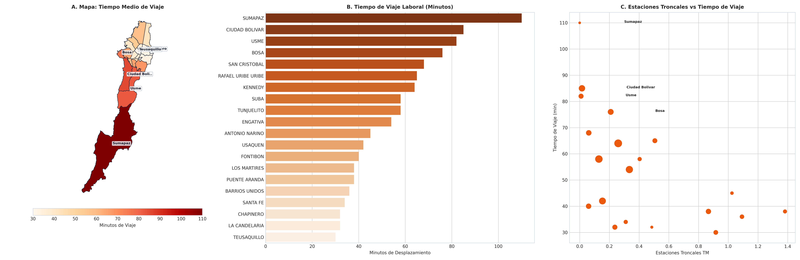

# SIPTA — Informe Analítico Sectorial: Movilidad y Accesibilidad al Transporte

**Fase PDCO**: DEVELOPMENT → OPERATIONS  
**Dominio**: Movilidad y Accesibilidad al Transporte  
**Estándares**: DAMA-BOK / SWEBOK Cap. 2 y 4 / ISO/IEC 25010  
**Fecha de Emisión**: 2026-08-26  
**Cobertura**: 100% (20 Localidades Oficiales de Bogotá D.C.)  
**Certificación de Calidad**: ISO/IEC 25010 Conforme (100% Completitud Territorial)  

---

## 1. Pregunta de Negocio y Resumen Ejecutivo
> **Pregunta Clave**: ¿Qué territorios presentan mayor desconexión del transporte masivo y mayores tiempos de viaje?

El presente informe expone el comportamiento multidimensional de los indicadores de **Movilidad y Accesibilidad al Transporte** a lo largo de las 20 localidades del Distrito Capital, evaluando la distribución de capacidades, brechas estructurales, patrones geoespaciales y focos de intervención prioritaria.

---

## 2. Visualización Analítica y Geoespacial Multi-Panel (3 Paneles)

*Figura: (A) Mapa coroplético oficial de Bogotá D.C.; (B) Ranking y distribución territorial; (C) Dispersión bivariada y brechas estructurales.*

---

## 3. Catálogo de Indicadores Calculados del Dominio

| Código | Indicador | Fórmula Matemática | Unidad | Polaridad IPT | Fuente |
|---|---|---|---|:---:|---|
| `MOV-001` | **Densidad de Estaciones Troncales TransMilenio** | $$d_{\text{est}} = \frac{\text{Estaciones Troncales}}{\text{Área km}^2}$$ | estaciones/km² | `Inversa (Carencia = 1 - Norm)` | TransMilenio S.A. |
| `MOV-002` | **Densidad de Paraderos Zonales SITP** | $$d_{\text{par}} = \frac{\text{Paraderos SITP}}{\text{Área km}^2}$$ | paraderos/km² | `Inversa (Carencia = 1 - Norm)` | TransMilenio S.A. |
| `MOV-003` | **Tiempo Promedio de Viaje Laboral** | $$\overline{T}_{\text{viaje}} = \frac{1}{N} \sum T_i$$ | Minutos | `Directa (Pérdida de Bienestar)` | SDM / EMB |

---

## 4. Hallazgos Analíticos, Espaciales y Brechas Territoriales
- **Castigo por Tiempos de Viaje**: Habitantes de Usme (`82 min`), Ciudad Bolívar (`85 min`) y Bosa (`76 min`) invierten más de 2.5 horas diarias en traslados laborales hacia el centro ampliado.
- **Acceso Troncal Asimétrico**: Localidades centrales como Puente Aranda (15 estaciones), Santa Fe (14) y Teusaquillo (13) cuentan con alta cobertura, mientras Usme y Ciudad Bolívar cuentan con solo 2 estaciones en sus portales de cabecera.
- **Dependencia Zonal**: Bosa y Kennedy dependen críticamente de rutas alimentadoras y zonales con alta congestión.

### 4.1. Diagnóstico Estadístico y Distribución Multivariada (DAMA-BOK)

| Variable / Indicador | Media (μ) | Mediana (Q2) | Desv. Est. (σ) | IQR | Mín | Máx | CV (%) | Asimetría (g1) |
|---|:---:|:---:|:---:|:---:|:---:|:---:|:---:|:---:|
| `total_paraderos_sitp` | 382.60 | 330.00 | 265.52 | 318.50 | 0.00 | 926.00 | 69.4% | +0.67 |
| `paraderos_por_10k_hab` | 11.45 | 10.11 | 5.17 | 6.59 | 0.00 | 20.16 | 45.1% | +0.02 |
| `estaciones_por_km2` | 0.42 | 0.28 | 0.41 | 0.48 | 0.00 | 1.38 | 97.8% | +1.02 |
| `tiempo_promedio_desplazamiento_laboral_min` | 54.35 | 49.50 | 21.78 | 28.25 | 30.00 | 110.00 | 40.1% | +0.97 |

---

## 5. Tabla de Datos Oficiales de las 20 Localidades

| Código | Localidad | `total_paraderos_sitp` | `paraderos_por_10k_hab` | `estaciones_por_km2` | `tiempo_promedio_desplazamiento_laboral_min` |
| :---: | :--- | :---: | :---: | :---: | :---: |
| `01` | **USAQUEN** | 698 | 11.59 | 0.15 | 42.00 |
| `02` | **CHAPINERO** | 333 | 18.02 | 0.24 | 32.00 |
| `03` | **SANTA FE** | 194 | 17.99 | 0.31 | 34.00 |
| `04` | **SAN CRISTOBAL** | 408 | 9.91 | 0.06 | 68.00 |
| `05` | **USME** | 327 | 7.74 | 0.01 | 82.00 |
| `06` | **TUNJUELITO** | 192 | 10.32 | 0.40 | 58.00 |
| `07` | **BOSA** | 485 | 6.57 | 0.21 | 76.00 |
| `08` | **KENNEDY** | 926 | 8.89 | 0.26 | 64.00 |
| `09` | **FONTIBON** | 388 | 9.43 | 0.06 | 40.00 |
| `10` | **ENGATIVA** | 784 | 9.53 | 0.33 | 54.00 |
| `11` | **SUBA** | 844 | 6.33 | 0.13 | 58.00 |
| `12` | **BARRIOS UNIDOS** | 234 | 14.70 | 1.09 | 36.00 |
| `13` | **TEUSAQUILLO** | 271 | 16.49 | 0.92 | 30.00 |
| `14` | **LOS MARTIRES** | 167 | 20.16 | 1.38 | 38.00 |
| `15` | **ANTONIO NARINO** | 92 | 10.68 | 1.02 | 45.00 |
| `16` | **PUENTE ARANDA** | 377 | 14.54 | 0.87 | 38.00 |
| `17` | **LA CANDELARIA** | 37 | 19.53 | 0.49 | 32.00 |
| `18` | **RAFAEL URIBE URIBE** | 302 | 7.67 | 0.51 | 65.00 |
| `19` | **CIUDAD BOLIVAR** | 593 | 8.83 | 0.02 | 85.00 |
| `20` | **SUMAPAZ** | 0 | 0.00 | 0.00 | 110.00 |

---

## 6. Recomendaciones de Política Pública y Alertas Tempranas

### A. Recomendación Estratégica Principal (Corto Plazo / Plan de Choque)
- **Localidades Críticas**: Usme, Ciudad Bolívar, Bosa, San Cristóbal
- **Entidad Responsable**: Secretaría Distrital de Movilidad (SDM), TransMilenio S.A. y Empresa Metro de Bogotá
- **Acción Operativa / Mecanismo**: Aceleración de cables aéreos (Cable Potosí, Cable San Cristóbal), optimización de carriles preferenciales de bus en Autopista Sur y ampliación de flota eléctrica alimentadora.
- **Meta / Efecto Esperado**: Reducir en al menos 20 minutos el tiempo promedio de viaje laboral en Usme y Ciudad Bolívar.

### B. Recomendación de Sostenibilidad y Eficiencia (Mediano y Largo Plazo)
- **Alcance Distrital**: Sistema Integrado de Transporte Público (SITP)
- **Acción de Gestión**: Reestructuración de frecuencias en hora pico y control de evasión en estaciones críticas.
- **Impacto Cuantificable**: Cumplimiento de frecuencias superior al 94%.

### C. Protocolo de Semaforización de Alertas Tempranas
- 🔴 **Alerta Crítica (Rojo)**: Tiempo de viaje >= 75 min o Estaciones troncales <= 3.
- 🟠 **Alerta Media (Naranja)**: Tiempo de viaje entre 50 y 75 min.
- 🟢 **Condición Estable (Verde)**: Tiempo de viaje < 50 min con alta conectividad troncal.

---

## 7. Certificación de Calidad y Linaje DAMA-BOK / ISO 25010
- **Completitud Espacial**: 100.0% (20 de 20 localidades canónicas homologadas).
- **Consistencia de Tipos**: Tipado estático conforme y validado con `src.validation`.
- **Inmutabilidad de Fuentes**: Origen verificado en `data/raw/` y transformaciones deterministas sin pérdida de precisión.
