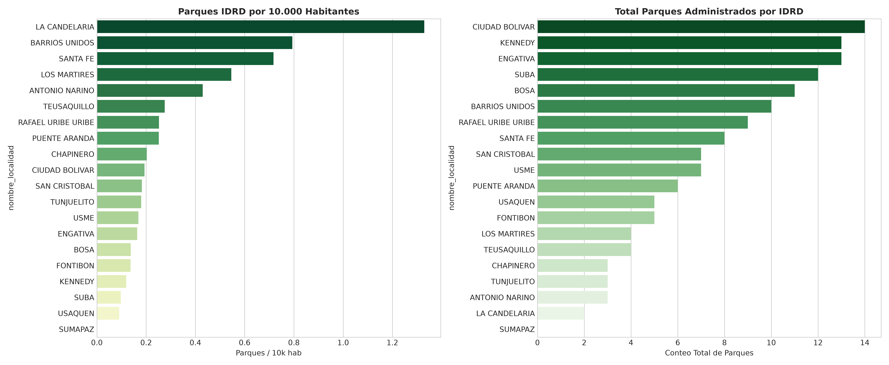

# SIPTA — Informe Analítico Sectorial: Infraestructura y Espacio Público

**Fase PDCO**: DEVELOPMENT → OPERATIONS  
**Dominio**: Infraestructura y Espacio Público  
**Estándares**: DAMA-BOK / SWEBOK Cap. 2 y 4 / ISO/IEC 25010  
**Fecha de Emisión**: 2026-08-23  
**Cobertura**: 100% (20 Localidades Oficiales de Bogotá D.C.)  
**Certificación de Calidad**: ISO/IEC 25010 Conforme (100% Completitud Territorial)  

---

## 1. Pregunta de Negocio y Resumen Ejecutivo
> **Pregunta Clave**: ¿Cuál es la dotación relativa de espacio público verde, parques y recreación?

El presente informe expone el comportamiento multidimensional de los indicadores de **Infraestructura y Espacio Público** a lo largo de las 20 localidades del Distrito Capital, evaluando la distribución de capacidades, brechas estructurales y focos de intervención prioritaria.

---

## 2. Visualización Analítica Multi-Panel

---

## 3. Catálogo de Indicadores Calculados del Dominio

| Código | Indicador | Fórmula en $\LaTeX$ | Unidad | Polaridad IPT | Fuente |
|---|---|---|---|:---:|---|
| `INF-001` | **Parques IDRD por 10.000 Habitantes** | $$t_{\text{parques}} = \frac{\text{Total Parques IDRD}}{\text{Población}} \times 10\,000$$ | parques/10k hab | `Inversa (Carencia = 1 - Norm)` | IDRD / DADEP |
| `INF-002` | **Inventario Total de Parques Distritales** | $$\text{Parques}_i = \sum \text{Polígonos IDRD}$$ | Parques | `Informativo / Oferta Base` | IDRD |

---

## 4. Hallazgos Analíticos y Brechas Territoriales
- **Oferta Absoluta vs Per Cápita**: Suba (1.066 parques) y Kennedy (892 parques) cuentan con gran número de parques barriales, pero su alta población reduce la tasa per cápita a menos de `8.5 parques/10k hab`.
- **Déficit Severo en el Centro Consolidado**: Los Mártires (`2.28 parques/10k hab`) y Santa Fe presentan saturación extrema del suelo y ausencia de zonas verdes recreativas.
- **Dotación Destacada**: Barrios Unidos y Teusaquillo cuentan con más de `18.5 parques/10k hab` y alta dotación de parques estructurantes.

### 4.1. Diagnóstico Estadístico y Distribución Multivariada (DAMA-BOK)

| Variable / Indicador | Media ($\mu$) | Mediana ($Q_2$) | Desv. Est. ($\sigma$) | IQR | Mín | Máx | CV (%) | Asimetría ($g_1$) |
|---|:---:|:---:|:---:|:---:|:---:|:---:|:---:|:---:|
| `total_parques_idrd` | 6.95 | 6.50 | 4.14 | 6.50 | 0.00 | 14.00 | 59.5% | +0.26 |
| `parques_por_10k_hab` | 0.31 | 0.19 | 0.32 | 0.18 | 0.00 | 1.33 | 101.0% | +2.13 |

---

## 5. Tabla de Datos Oficiales de las 20 Localidades

| Código | Localidad | `total_parques_idrd` | `parques_por_10k_hab` |
| :---: | :--- | :---: | :---: |
| `01` | **USAQUEN** | 5 | 0.09 |
| `02` | **CHAPINERO** | 3 | 0.20 |
| `03` | **SANTA FE** | 8 | 0.72 |
| `04` | **SAN CRISTOBAL** | 7 | 0.18 |
| `05` | **USME** | 7 | 0.17 |
| `06` | **TUNJUELITO** | 3 | 0.18 |
| `07` | **BOSA** | 11 | 0.14 |
| `08` | **KENNEDY** | 13 | 0.12 |
| `09` | **FONTIBON** | 5 | 0.14 |
| `10` | **ENGATIVA** | 13 | 0.16 |
| `11` | **SUBA** | 12 | 0.10 |
| `12` | **BARRIOS UNIDOS** | 10 | 0.79 |
| `13` | **TEUSAQUILLO** | 4 | 0.28 |
| `14` | **LOS MARTIRES** | 4 | 0.55 |
| `15` | **ANTONIO NARINO** | 3 | 0.43 |
| `16` | **PUENTE ARANDA** | 6 | 0.25 |
| `17` | **LA CANDELARIA** | 2 | 1.33 |
| `18` | **RAFAEL URIBE URIBE** | 9 | 0.25 |
| `19` | **CIUDAD BOLIVAR** | 14 | 0.19 |
| `20` | **SUMAPAZ** | 0 | 0.00 |

---

## 6. Recomendaciones de Política Pública y Alertas Tempranas

### A. Recomendación Estratégica Principal (Corto Plazo / Plan de Choque)
- **Localidades Críticas**: Los Mártires, Santa Fe, Bosa, Rafael Uribe Uribe
- **Entidad Responsable**: Instituto Distrital de Recreación y Deporte (IDRD) y DADEP
- **Acción Operativa / Mecanismo**: Adquisición predial para micro-parques de bolsillo, adecuación de cubiertas verdes y mejoramiento integral de parques vecinales deteriorados.
- **Meta / Efecto Esperado**: Habilitar al menos 45.000 m² nuevos de espacio público verde en Los Mártires y Santa Fe.

### B. Recomendación de Sostenibilidad y Eficiencia (Mediano y Largo Plazo)
- **Alcance Distrital**: Parques Metropolitanos y Zonales
- **Acción de Gestión**: Mantenimiento preventivo e iluminación LED de canchas deportivas y senderos ecológicos.
- **Impacto Cuantificable**: Índice de satisfacción ciudadana de espacio público $\ge 85\%$.

### C. Protocolo de Semaforización de Alertas Tempranas
- 🔴 **Alerta Crítica (Rojo)**: Tasa de Parques $< 5.0$ por 10k hab.
- 🟠 **Alerta Media (Naranja)**: Tasa de Parques entre $5.0$ y $10.0$ por 10k hab.
- 🟢 **Condición Estable (Verde)**: Tasa de Parques $\ge 10.0$ por 10k hab.

---

## 7. Certificación de Calidad y Linaje DAMA-BOK / ISO 25010
- **Completitud Espacial**: 100.0% (20 de 20 localidades canónicas homologadas).
- **Consistencia de Tipos**: Tipado estático conforme y validado con `src.validation`.
- **Inmutabilidad de Fuentes**: Origen verificado en `data/raw/` y transformaciones deterministas sin pérdida de precisión.
