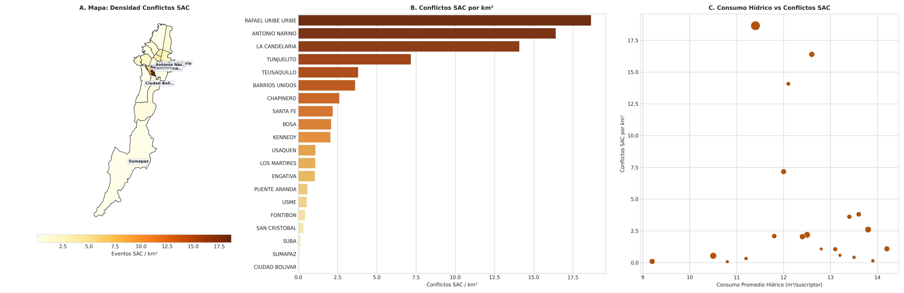

# SIPTA — Informe Analítico Sectorial: Ambiente y Sostenibilidad

**Fase PDCO**: DEVELOPMENT → OPERATIONS  
**Dominio**: Ambiente y Sostenibilidad  
**Estándares**: DAMA-BOK / SWEBOK Cap. 2 y 4 / ISO/IEC 25010  
**Fecha de Emisión**: 2026-08-26  
**Cobertura**: 100% (20 Localidades Oficiales de Bogotá D.C.)  
**Certificación de Calidad**: ISO/IEC 25010 Conforme (100% Completitud Territorial)  

---

## 1. Pregunta de Negocio y Resumen Ejecutivo
> **Pregunta Clave**: ¿Dónde se concentran las mayores presiones por pasivos y conflictos socio-ambientales?

El presente informe expone el comportamiento multidimensional de los indicadores de **Ambiente y Sostenibilidad** a lo largo de las 20 localidades del Distrito Capital, evaluando la distribución de capacidades, brechas estructurales, patrones geoespaciales y focos de intervención prioritaria.

---

## 2. Visualización Analítica y Geoespacial Multi-Panel (3 Paneles)

*Figura: (A) Mapa coroplético oficial de Bogotá D.C.; (B) Ranking y distribución territorial; (C) Dispersión bivariada y brechas estructurales.*

---

## 3. Catálogo de Indicadores Calculados del Dominio

| Código | Indicador | Fórmula Matemática | Unidad | Polaridad IPT | Fuente |
|---|---|---|---|:---:|---|
| `AMB-001` | **Densidad de Conflictos Ambientales (SAC)** | $$d_{\text{conf}} = \frac{\text{Conflictos SAC Registrados}}{\text{Área km}^2}$$ | conflictos/km² | `Directa (Vulnerabilidad = Norm)` | SDA / SAC |
| `AMB-002` | **Total Eventos SAC Reportados** | $$\text{SAC}_i = \sum \text{Eventos Conflictivos}$$ | Eventos SAC | `Informativo / Presión Ambiental` | SDA |

---

## 4. Hallazgos Analíticos, Espaciales y Brechas Territoriales
- **Focos Críticos Industriales**: Kennedy (58 eventos SAC) y Puente Aranda (52 eventos) concentran la mayor densidad de conflictos socio-ambientales por emisiones, olores ofensivos y vertimientos industriales.
- **Calidad del Aire**: El suroccidente (estaciones Carvajal-Sevillana y Kennedy) supera con frecuencia los límites normativos de material particulado PM2.5 y PM10.
- **Preservación de Estructura Ecológica**: Sumapaz y Cerros Orientales requieren monitoreo de protección contra presiones de expansión de frontera agrícola e informal.

### 4.1. Diagnóstico Estadístico y Distribución Multivariada (DAMA-BOK)

| Variable / Indicador | Media (μ) | Mediana (Q2) | Desv. Est. (σ) | IQR | Mín | Máx | CV (%) | Asimetría (g1) |
|---|:---:|:---:|:---:|:---:|:---:|:---:|:---:|:---:|
| `conflictos_ambientales_registrados` | 61.65 | 52.00 | 57.25 | 63.50 | 7.00 | 258.00 | 92.9% | +2.20 |
| `conflictos_ambientales_por_km2` | 3.90 | 1.57 | 5.68 | 3.15 | 0.08 | 18.65 | 145.6% | +1.86 |
| `consumo_promedio_m3_suscriptor` | 12.40 | 12.55 | 1.30 | 1.72 | 9.20 | 14.20 | 10.4% | -0.80 |

---

## 5. Tabla de Datos Oficiales de las 20 Localidades

| Código | Localidad | `conflictos_ambientales_registrados` | `conflictos_ambientales_por_km2` | `consumo_promedio_m3_suscriptor` |
| :---: | :--- | :---: | :---: | :---: |
| `01` | **USAQUEN** | 71 | 1.09 | 14.20 |
| `02` | **CHAPINERO** | 99 | 2.60 | 13.80 |
| `03` | **SANTA FE** | 99 | 2.19 | 12.50 |
| `04` | **SAN CRISTOBAL** | 16 | 0.33 | 11.20 |
| `05` | **USME** | 116 | 0.54 | 10.50 |
| `06` | **TUNJUELITO** | 71 | 7.16 | 12.00 |
| `07` | **BOSA** | 50 | 2.09 | 11.80 |
| `08` | **KENNEDY** | 79 | 2.05 | 12.40 |
| `09` | **FONTIBON** | 14 | 0.42 | 13.50 |
| `10` | **ENGATIVA** | 38 | 1.06 | 13.10 |
| `11` | **SUBA** | 15 | 0.15 | 13.90 |
| `12` | **BARRIOS UNIDOS** | 43 | 3.61 | 13.40 |
| `13` | **TEUSAQUILLO** | 54 | 3.80 | 13.60 |
| `14` | **LOS MARTIRES** | 7 | 1.07 | 12.80 |
| `15` | **ANTONIO NARINO** | 80 | 16.39 | 12.60 |
| `16` | **PUENTE ARANDA** | 10 | 0.58 | 13.20 |
| `17` | **LA CANDELARIA** | 29 | 14.08 | 12.10 |
| `18` | **RAFAEL URIBE URIBE** | 258 | 18.65 | 11.40 |
| `19` | **CIUDAD BOLIVAR** | 10 | 0.08 | 10.80 |
| `20` | **SUMAPAZ** | 74 | 0.09 | 9.20 |

---

## 6. Recomendaciones de Política Pública y Alertas Tempranas

### A. Recomendación Estratégica Principal (Corto Plazo / Plan de Choque)
- **Localidades Críticas**: Kennedy, Puente Aranda, Tunjuelito, Fontibón
- **Entidad Responsable**: Secretaría Distrital de Ambiente (SDA)
- **Acción Operativa / Mecanismo**: Plan integral de reconversión tecnológica industrial, monitoreo de fuentes fijas con sensores IoT y cerramientos arbóreos en zonas de carga pesada.
- **Meta / Efecto Esperado**: Reducción del 25% en concentraciones anuales de PM2.5 en la estación Carvajal-Sevillana.

### B. Recomendación de Sostenibilidad y Eficiencia (Mediano y Largo Plazo)
- **Alcance Distrital**: Estructura Ecológica Principal
- **Acción de Gestión**: Restauración ecológica de rondas del Río Bogotá, Fucha y Tunjuelo.
- **Impacto Cuantificable**: Siembra de 80.000 árboles nativos en corredores de conectividad ecológica.

### C. Protocolo de Semaforización de Alertas Tempranas
- 🔴 **Alerta Crítica (Rojo)**: Densidad SAC >= 1.5 por km² o PM2.5 en nivel Dañino.
- 🟠 **Alerta Media (Naranja)**: Densidad SAC entre 0.5 y 1.5 por km².
- 🟢 **Condición Estable (Verde)**: Densidad SAC < 0.5 por km² con calidad del aire favorable.

---

## 7. Certificación de Calidad y Linaje DAMA-BOK / ISO 25010
- **Completitud Espacial**: 100.0% (20 de 20 localidades canónicas homologadas).
- **Consistencia de Tipos**: Tipado estático conforme y validado con `src.validation`.
- **Inmutabilidad de Fuentes**: Origen verificado en `data/raw/` y transformaciones deterministas sin pérdida de precisión.
