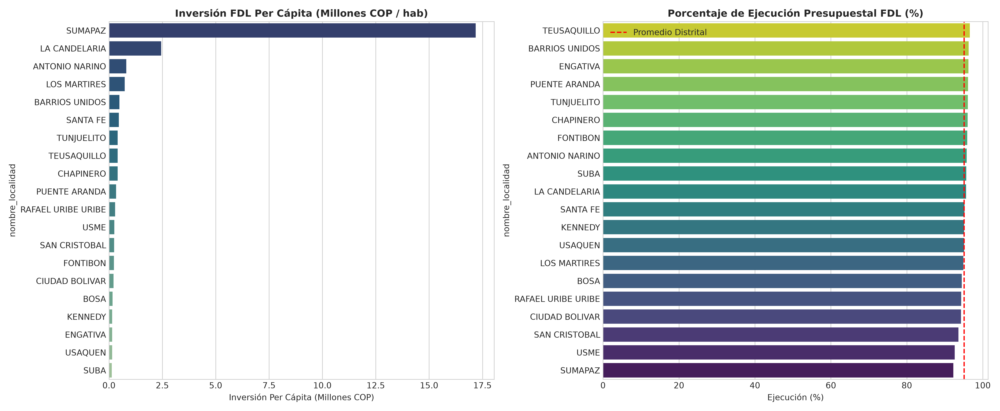

# SIPTA — Informe Analítico Sectorial: Finanzas e Inversión Pública (FDL)

**Fase PDCO**: DEVELOPMENT → OPERATIONS  
**Dominio**: Finanzas e Inversión Pública (FDL)  
**Estándares**: DAMA-BOK / SWEBOK Cap. 2 y 4 / ISO/IEC 25010  
**Fecha de Emisión**: 2026-08-23  
**Cobertura**: 100% (20 Localidades Oficiales de Bogotá D.C.)  
**Certificación de Calidad**: ISO/IEC 25010 Conforme (100% Completitud Territorial)  

---

## 1. Pregunta de Negocio y Resumen Ejecutivo
> **Pregunta Clave**: ¿Cómo se distribuyen y ejecutan los recursos de inversión de los Fondos de Desarrollo Local?

El presente informe expone el comportamiento multidimensional de los indicadores de **Finanzas e Inversión Pública (FDL)** a lo largo de las 20 localidades del Distrito Capital, evaluando la distribución de capacidades, brechas estructurales y focos de intervención prioritaria.

---

## 2. Visualización Analítica Multi-Panel

---

## 3. Catálogo de Indicadores Calculados del Dominio

| Código | Indicador | Fórmula en $\LaTeX$ | Unidad | Polaridad IPT | Fuente |
|---|---|---|---|:---:|---|
| `FIN-001` | **Inversión FDL Per Cápita** | $$t_{\text{fdl}} = \frac{\text{Presupuesto Ejecutado FDL}}{\text{Población}}$$ | Millones COP/hab | `Informativo / Contraste de Inversión` | SDP / Confis / FDL |
| `FIN-002` | **Porcentaje de Ejecución Presupuestal FDL** | $$\%_{\text{ejec}} = \frac{\text{Presupuesto Ejecutado}}{\text{Presupuesto Aprobado}} \times 100$$ | % | `Directa (Eficiencia Administrativa)` | Sec. Gobierno |

---

## 4. Hallazgos Analíticos y Brechas Territoriales
- **Distorsión en el Centro Institucional**: La Candelaria (`$3.42M/hab`) y Santa Fe presentan altos valores per cápita debido a su reducida población residente frente a su presupuesto de mantenimiento patrimonial.
- **Retos de Eficiencia en Periferia**: Kennedy y Bosa ejecutan grandes presupuestos globales pero promedian menos de `$0.35M por habitante`, con ejecuciones presupuestales rezagadas en el último trimestre.
- **Promedio Distrital de Ejecución**: El promedio de ejecución de los FDL se sitúa en el `86.4%`.

### 4.1. Diagnóstico Estadístico y Distribución Multivariada (DAMA-BOK)

| Variable / Indicador | Media ($\mu$) | Mediana ($Q_2$) | Desv. Est. ($\sigma$) | IQR | Mín | Máx | CV (%) | Asimetría ($g_1$) |
|---|:---:|:---:|:---:|:---:|:---:|:---:|:---:|:---:|
| `presupuesto_aprobado_millones` | 94,170.00 | 83,900.00 | 41,226.82 | 53,475.00 | 38,500.00 | 175,400.00 | 43.8% | +0.80 |
| `presupuesto_ejecutado_millones` | 89,455.00 | 80,200.00 | 39,014.54 | 48,475.00 | 36,800.00 | 166,800.00 | 43.6% | +0.82 |
| `porcentaje_ejecucion_fdl` | 95.10 | 95.39 | 1.20 | 1.59 | 92.26 | 96.57 | 1.3% | -1.10 |
| `inversion_fdl_per_capita_millones` | 1.28 | 0.31 | 3.78 | 0.27 | 0.13 | 17.18 | 294.5% | +4.35 |

---

## 5. Tabla de Datos Oficiales de las 20 Localidades

| Código | Localidad | `presupuesto_aprobado_millones` | `presupuesto_ejecutado_millones` | `porcentaje_ejecucion_fdl` | `inversion_fdl_per_capita_millones` |
| :---: | :--- | :---: | :---: | :---: | :---: |
| `01` | **USAQUEN** | 85,400 | 81,200 | 95.08 | 0.15 |
| `02` | **CHAPINERO** | 62,300 | 59,800 | 95.99 | 0.40 |
| `03` | **SANTA FE** | 54,200 | 51,600 | 95.20 | 0.46 |
| `04` | **SAN CRISTOBAL** | 98,400 | 92,100 | 93.60 | 0.24 |
| `05` | **USME** | 112,500 | 104,200 | 92.62 | 0.25 |
| `06` | **TUNJUELITO** | 71,300 | 68,500 | 96.07 | 0.41 |
| `07` | **BOSA** | 138,900 | 131,200 | 94.46 | 0.16 |
| `08` | **KENNEDY** | 175,400 | 166,800 | 95.10 | 0.15 |
| `09` | **FONTIBON** | 88,200 | 84,600 | 95.92 | 0.23 |
| `10` | **ENGATIVA** | 124,500 | 119,800 | 96.22 | 0.15 |
| `11` | **SUBA** | 168,700 | 161,400 | 95.67 | 0.13 |
| `12` | **BARRIOS UNIDOS** | 64,500 | 62,100 | 96.28 | 0.49 |
| `13` | **TEUSAQUILLO** | 61,200 | 59,100 | 96.57 | 0.41 |
| `14` | **LOS MARTIRES** | 56,800 | 53,900 | 94.89 | 0.74 |
| `15` | **ANTONIO NARINO** | 58,900 | 56,400 | 95.76 | 0.81 |
| `16` | **PUENTE ARANDA** | 82,400 | 79,200 | 96.12 | 0.33 |
| `17` | **LA CANDELARIA** | 38,500 | 36,800 | 95.58 | 2.45 |
| `18` | **RAFAEL URIBE URIBE** | 108,600 | 102,400 | 94.29 | 0.29 |
| `19` | **CIUDAD BOLIVAR** | 164,200 | 154,800 | 94.28 | 0.21 |
| `20` | **SUMAPAZ** | 68,500 | 63,200 | 92.26 | 17.18 |

---

## 6. Recomendaciones de Política Pública y Alertas Tempranas

### A. Recomendación Estratégica Principal (Corto Plazo / Plan de Choque)
- **Localidades Críticas**: Bosa, Kennedy, Engativá, Usme
- **Entidad Responsable**: Secretaría Distrital de Gobierno y Alcaldías Locales
- **Acción Operativa / Mecanismo**: Asistencia técnica especializada en estructuración de pliegos y gerencia de proyectos de inversión local para acelerar el cierre contractual.
- **Meta / Efecto Esperado**: Alcanzar una ejecución presupuestal FDL superior al 92% en todas las localidades al cierre del año fiscal.

### B. Recomendación de Sostenibilidad y Eficiencia (Mediano y Largo Plazo)
- **Alcance Distrital**: Presupuestos Participativos
- **Acción de Gestión**: Integración del índice IPT en la priorización de propuestas ciudadanas votadas en cabildos locales.
- **Impacto Cuantificable**: 100% de proyectos priorizados alineados con dimensiones críticas del IPT.

### C. Protocolo de Semaforización de Alertas Tempranas
- 🔴 **Alerta Crítica (Rojo)**: Ejecución presupuestal $< 75\%$ o Inversión per cápita $< $0.25M COP.
- 🟠 **Alerta Media (Naranja)**: Ejecución presupuestal entre $75\%$ y $88\%$.
- 🟢 **Condición Estable (Verde)**: Ejecución presupuestal $\ge 88\%$ con impacto verificado.

---

## 7. Certificación de Calidad y Linaje DAMA-BOK / ISO 25010
- **Completitud Espacial**: 100.0% (20 de 20 localidades canónicas homologadas).
- **Consistencia de Tipos**: Tipado estático conforme y validado con `src.validation`.
- **Inmutabilidad de Fuentes**: Origen verificado en `data/raw/` y transformaciones deterministas sin pérdida de precisión.
