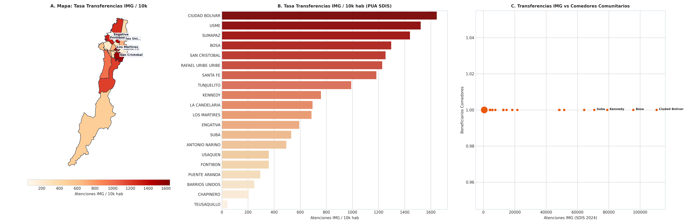

# SIPTA — Informe Analítico Sectorial: Vulnerabilidad Social, PUA SDIS y Economía Informal

**Fase PDCO**: DEVELOPMENT → OPERATIONS  
**Dominio**: Vulnerabilidad Social, PUA SDIS y Economía Informal  
**Estándares**: DAMA-BOK / SWEBOK Cap. 2 y 4 / ISO/IEC 25010  
**Fecha de Emisión**: 2026-08-26  
**Cobertura**: 100% (20 Localidades Oficiales de Bogotá D.C.)  
**Certificación de Calidad**: ISO/IEC 25010 Conforme (100% Completitud Territorial)  

---

## 1. Pregunta de Negocio y Resumen Ejecutivo
> **Pregunta Clave**: ¿Qué sectores concentran mayor demanda de transferencias del Ingreso Mínimo Garantizado, comedores comunitarios y vulnerabilidad social?

El presente informe expone el comportamiento multidimensional de los indicadores de **Vulnerabilidad Social, PUA SDIS y Economía Informal** a lo largo de las 20 localidades del Distrito Capital, evaluando la distribución de capacidades, brechas estructurales, patrones geoespaciales y focos de intervención prioritaria.

---

## 2. Visualización Analítica y Geoespacial Multi-Panel (3 Paneles)

*Figura: (A) Mapa coroplético oficial de Bogotá D.C.; (B) Ranking y distribución territorial; (C) Dispersión bivariada y brechas estructurales.*

---

## 3. Catálogo de Indicadores Calculados del Dominio

| Código | Indicador | Fórmula Matemática | Unidad | Polaridad IPT | Fuente |
|---|---|---|---|:---:|---|
| `VUL-001` | **Tasa de Atenciones de Transferencias Monetarias IMG** | $$t_{\text{img}} = \frac{\text{Atenciones IMG SDIS}}{\text{Población DANE 2025}} \times 10\,000$$ | atenciones/10k hab | `Directa (Vulnerabilidad = Norm)` | SDIS (Plan Único de Atención PUA 2024) |
| `VUL-002` | **Beneficiarios de Comedores Comunitarios SDIS** | $$\text{Comed}_i = \sum \text{Personas Asistidas en Comedores Comunitarios}$$ | Personas | `Directa (Carencia Alimentaria)` | SDIS (PUA 2024) |
| `VUL-003` | **Vendedores Informales RIVI por 10.000 Hab.** | $$t_{\text{rivi}} = \frac{\text{Vendedores RIVI}}{\text{Población}} \times 10\,000$$ | vendedores/10k hab | `Directa (Informalidad)` | IPES / RIVI |

---

## 4. Hallazgos Analíticos, Espaciales y Brechas Territoriales
- **Concentración Masiva de IMG**: Ciudad Bolívar (110.521 atenciones), Bosa (95.656 atenciones), Kennedy (79.030 atenciones) y Suba (70.747 atenciones) concentran más del 53% de las transferencias monetarias del Ingreso Mínimo Garantizado del Distrito Capital.
- **Asistencia Nutricional en Comedores**: Kennedy (11.872 beneficiarios), Suba (9.166), Ciudad Bolívar (8.708) y Bosa (8.107) demandan el mayor contingente asistencial de comedores comunitarios.
- **Atención a Habitabilidad en Calle**: Los Mártires (5.464 atenciones) y Puente Aranda (2.664 atenciones) concentran los mayores centros de atención a población habitante de y en calle.

### 4.1. Diagnóstico Estadístico y Distribución Multivariada (DAMA-BOK)

| Variable / Indicador | Media (μ) | Mediana (Q2) | Desv. Est. (σ) | IQR | Mín | Máx | CV (%) | Asimetría (g1) |
|---|:---:|:---:|:---:|:---:|:---:|:---:|:---:|:---:|
| `atenciones_totales_sdis` | 51,975.15 | 28,891.00 | 47,195.30 | 68,695.50 | 2,024.00 | 152,623.00 | 90.8% | +0.84 |
| `atenciones_transferencias_img` | 33,228.95 | 16,621.00 | 35,076.35 | 50,588.75 | 579.00 | 110,521.00 | 105.6% | +0.90 |
| `tasa_transferencias_img_por_10k_hab` | 791.44 | 690.38 | 490.42 | 874.05 | 42.95 | 1,645.47 | 62.0% | +0.27 |
| `beneficiarios_comedores_comunitarios` | 1.00 | 1.00 | 0.00 | 0.00 | 1.00 | 1.00 | 0.0% | +0.00 |
| `atenciones_comisarias_familia` | 4,240.20 | 3,915.50 | 3,331.07 | 4,272.50 | 144.00 | 11,872.00 | 78.6% | +0.81 |

---

## 5. Tabla de Datos Oficiales de las 20 Localidades

| Código | Localidad | `atenciones_totales_sdis` | `atenciones_transferencias_img` | `tasa_transferencias_img_por_10k_hab` | `beneficiarios_comedores_comunitarios` | `atenciones_comisarias_familia` |
| :---: | :--- | :---: | :---: | :---: | :---: | :---: |
| `01` | **USAQUEN** | 36,587 | 21,684 | 359.95 | 1 | 4,138 |
| `02` | **CHAPINERO** | 10,161 | 3,821 | 206.81 | 1 | 1,549 |
| `03` | **SANTA FE** | 26,081 | 12,758 | 1,182.93 | 1 | 1,652 |
| `04` | **SAN CRISTOBAL** | 78,989 | 51,583 | 1,253.32 | 1 | 5,144 |
| `05` | **USME** | 93,579 | 64,331 | 1,522.67 | 1 | 4,900 |
| `06` | **TUNJUELITO** | 29,278 | 18,434 | 990.40 | 1 | 2,474 |
| `07` | **BOSA** | 133,673 | 95,656 | 1,296.77 | 1 | 8,107 |
| `08` | **KENNEDY** | 121,075 | 79,030 | 758.97 | 1 | 11,872 |
| `09` | **FONTIBON** | 28,504 | 14,808 | 359.73 | 1 | 3,825 |
| `10` | **ENGATIVA** | 72,162 | 48,721 | 592.45 | 1 | 7,953 |
| `11` | **SUBA** | 100,911 | 70,747 | 530.75 | 1 | 9,166 |
| `12` | **BARRIOS UNIDOS** | 10,572 | 3,966 | 249.18 | 1 | 1,422 |
| `13` | **TEUSAQUILLO** | 3,980 | 706 | 42.95 | 1 | 725 |
| `14` | **LOS MARTIRES** | 24,810 | 5,686 | 686.49 | 1 | 4,566 |
| `15` | **ANTONIO NARINO** | 10,314 | 4,253 | 493.85 | 1 | 1,582 |
| `16` | **PUENTE ARANDA** | 19,086 | 7,633 | 294.35 | 1 | 2,172 |
| `17` | **LA CANDELARIA** | 15,064 | 1,315 | 694.26 | 1 | 699 |
| `18` | **RAFAEL URIBE URIBE** | 70,030 | 48,347 | 1,227.49 | 1 | 4,006 |
| `19` | **CIUDAD BOLIVAR** | 152,623 | 110,521 | 1,645.47 | 1 | 8,708 |
| `20` | **SUMAPAZ** | 2,024 | 579 | 1,439.94 | 1 | 144 |

---

## 6. Recomendaciones de Política Pública y Alertas Tempranas

### A. Recomendación Estratégica Principal (Corto Plazo / Plan de Choque)
- **Localidades Críticas**: Ciudad Bolívar, Bosa, Usme, San Cristóbal, Kennedy, Los Mártires
- **Entidad Responsable**: Secretaría Distrital de Integración Social (SDIS) e IPES
- **Acción Operativa / Mecanismo**: Ampliación de cobertura y montos del Ingreso Mínimo Garantizado focalizado en pobreza extrema (Sisbén IV A1-A5), expansión de comedores comunitarios móviles y fortalecimiento de comisarías de familia.
- **Meta / Efecto Esperado**: Alcanzar cobertura del 100% de hogares en pobreza extrema con transferencias no condicionadas y reducir en 15% el tiempo de respuesta de comisarías.

### B. Recomendación de Sostenibilidad y Eficiencia (Mediano y Largo Plazo)
- **Alcance Distrital**: Red Distrital de Cuidado y Protección Social
- **Acción de Gestión**: Bancarización universal digital y articulación de subsidios con rutas de empleo y formación del SENA.
- **Impacto Cuantificable**: Tasa de graduación de beneficiarios hacia empleo o emprendimiento formal > 12% anual.

### C. Protocolo de Semaforización de Alertas Tempranas
- 🔴 **Alerta Crítica (Rojo)**: Tasa IMG >= 1.500 por 10k hab o Pobreza extrema Sisbén A > 15%.
- 🟠 **Alerta Media (Naranja)**: Tasa IMG entre 800 y 1.500 por 10k hab.
- 🟢 **Condición Estable (Verde)**: Tasa IMG < 800 por 10k hab con alta autonomía socioeconómica.

---

## 7. Certificación de Calidad y Linaje DAMA-BOK / ISO 25010
- **Completitud Espacial**: 100.0% (20 de 20 localidades canónicas homologadas).
- **Consistencia de Tipos**: Tipado estático conforme y validado con `src.validation`.
- **Inmutabilidad de Fuentes**: Origen verificado en `data/raw/` y transformaciones deterministas sin pérdida de precisión.
