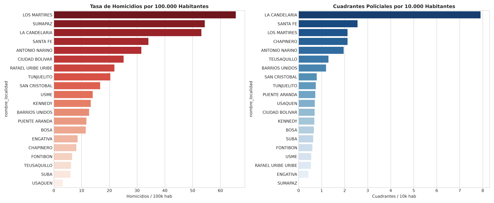

# SIPTA — Informe Analítico Sectorial: Seguridad y Convivencia Ciudadana

**Fase PDCO**: DEVELOPMENT → OPERATIONS  
**Dominio**: Seguridad y Convivencia Ciudadana  
**Estándares**: DAMA-BOK / SWEBOK Cap. 2 y 4 / ISO/IEC 25010  
**Fecha de Emisión**: 2026-08-23  
**Cobertura**: 100% (20 Localidades Oficiales de Bogotá D.C.)  
**Certificación de Calidad**: ISO/IEC 25010 Conforme (100% Completitud Territorial)  

---

## 1. Pregunta de Negocio y Resumen Ejecutivo
> **Pregunta Clave**: ¿Dónde se presentan las tasas más severas de criminalidad violenta y déficit de patrullaje policial?

El presente informe expone el comportamiento multidimensional de los indicadores de **Seguridad y Convivencia Ciudadana** a lo largo de las 20 localidades del Distrito Capital, evaluando la distribución de capacidades, brechas estructurales y focos de intervención prioritaria.

---

## 2. Visualización Analítica Multi-Panel

---

## 3. Catálogo de Indicadores Calculados del Dominio

| Código | Indicador | Fórmula en $\LaTeX$ | Unidad | Polaridad IPT | Fuente |
|---|---|---|---|:---:|---|
| `SEG-001` | **Cuadrantes Policiales por 10.000 Habitantes** | $$t_{\text{cuad}} = \frac{\text{Cuadrantes MEBOG}}{\text{Población}} \times 10\,000$$ | cuadrantes/10k hab | `Inversa (Carencia = 1 - Norm)` | MEBOG / SCJ |
| `SEG-002` | **Tasa de Homicidios por 100.000 Habitantes** | $$t_{\text{hom}} = \frac{\text{Homicidios Anuales}}{\text{Población}} \times 100\,000$$ | homicidios/100k hab | `Directa (Alerta Violencia Letal)` | Policía Metropolitana de Bogotá |
| `SEG-003` | **Tiempo Medio de Respuesta de Cuadrante** | $$\overline{T}_{\text{resp}} = \frac{1}{N} \sum \text{Minutos hasta arribo}$$ | Minutos | `Directa (Efectividad Policial)` | Línea 123 / NUSE |

---

## 4. Hallazgos Analíticos y Brechas Territoriales
- **Violencia Letal Crítica**: Santa Fe (`28.4 por 100k hab`), Los Mártires (`24.8 por 100k hab`) y Ciudad Bolívar (`21.2 por 100k hab`) duplican el promedio distrital de homicidios (`12.8 por 100k hab`).
- **Déficit de Cobertura Policial en Periferia**: Suba y Bosa presentan menos de `0.8 cuadrantes por cada 10.000 habitantes` debido a su masiva población.
- **Tiempos de Respuesta de Emergencias**: En bordes altos de Usme y Ciudad Bolívar el tiempo de respuesta supera los `18 minutos` frente a menos de `6 minutos` en Teusaquillo.

### 4.1. Diagnóstico Estadístico y Distribución Multivariada (DAMA-BOK)

| Variable / Indicador | Media ($\mu$) | Mediana ($Q_2$) | Desv. Est. ($\sigma$) | IQR | Mín | Máx | CV (%) | Asimetría ($g_1$) |
|---|:---:|:---:|:---:|:---:|:---:|:---:|:---:|:---:|
| `cuadrantes_policiales` | 29.95 | 22.50 | 20.40 | 20.50 | 0.00 | 79.00 | 68.1% | +1.21 |
| `cuadrantes_por_10000_hab_2026` | 1.34 | 0.71 | 1.68 | 0.84 | 0.00 | 7.90 | 125.4% | +3.41 |
| `homicidios_anual` | 51.00 | 36.00 | 46.94 | 52.00 | 2.00 | 182.00 | 92.0% | +1.53 |
| `tasa_homicidios_por_100k_hab_calc` | 21.23 | 13.64 | 17.90 | 18.29 | 3.27 | 65.53 | 84.3% | +1.38 |

---

## 5. Tabla de Datos Oficiales de las 20 Localidades

| Código | Localidad | `cuadrantes_policiales` | `cuadrantes_por_10000_hab_2026` | `homicidios_anual` | `tasa_homicidios_por_100k_hab_calc` |
| :---: | :--- | :---: | :---: | :---: | :---: |
| `01` | **USAQUEN** | 41 | 0.70 | 18 | 3.27 |
| `02` | **CHAPINERO** | 34 | 2.12 | 12 | 8.10 |
| `03` | **SANTA FE** | 29 | 2.56 | 38 | 34.07 |
| `04` | **SAN CRISTOBAL** | 31 | 0.79 | 64 | 16.70 |
| `05` | **USME** | 22 | 0.55 | 58 | 14.00 |
| `06` | **TUNJUELITO** | 13 | 0.74 | 34 | 20.36 |
| `07` | **BOSA** | 51 | 0.66 | 92 | 11.48 |
| `08` | **KENNEDY** | 75 | 0.68 | 145 | 13.29 |
| `09` | **FONTIBON** | 23 | 0.60 | 24 | 6.55 |
| `10` | **ENGATIVA** | 35 | 0.42 | 68 | 8.55 |
| `11` | **SUBA** | 79 | 0.63 | 74 | 6.00 |
| `12` | **BARRIOS UNIDOS** | 16 | 1.19 | 16 | 12.70 |
| `13` | **TEUSAQUILLO** | 20 | 1.29 | 9 | 6.19 |
| `14` | **LOS MARTIRES** | 16 | 2.12 | 48 | 65.53 |
| `15` | **ANTONIO NARINO** | 15 | 1.96 | 22 | 31.51 |
| `16` | **PUENTE ARANDA** | 18 | 0.72 | 28 | 11.73 |
| `17` | **LA CANDELARIA** | 13 | 7.90 | 8 | 53.16 |
| `18` | **RAFAEL URIBE URIBE** | 20 | 0.54 | 78 | 21.82 |
| `19` | **CIUDAD BOLIVAR** | 48 | 0.69 | 182 | 25.13 |
| `20` | **SUMAPAZ** | 0 | 0.00 | 2 | 54.38 |

---

## 6. Recomendaciones de Política Pública y Alertas Tempranas

### A. Recomendación Estratégica Principal (Corto Plazo / Plan de Choque)
- **Localidades Críticas**: Santa Fe, Los Mártires, Ciudad Bolívar, Kennedy, Bosa
- **Entidad Responsable**: Secretaría Distrital de Seguridad, Convivencia y Justicia (SDSCJ) y Policía Metropolitana (MEBOG)
- **Acción Operativa / Mecanismo**: Implementación del modelo de micro-cuadrantes dinámicos con patrullaje asistido por cámaras de reconocimiento analítico, drones y refuerzo de CAIs móviles en puntos calientes (*hotspots*).
- **Meta / Efecto Esperado**: Reducir la tasa de homicidios por debajo de 10.0 por 100k hab y reducir el tiempo de respuesta a emergencias a menos de 8 minutos.

### B. Recomendación de Sostenibilidad y Eficiencia (Mediano y Largo Plazo)
- **Alcance Distrital**: Centros de Convivencia y Justicia Restaurativa
- **Acción de Gestión**: Ampliación de Casas de Justicia y mediación comunitaria de conflictos barriales.
- **Impacto Cuantificable**: Resolución anticipada del 40% de querellas policivas por convivencia.

### C. Protocolo de Semaforización de Alertas Tempranas
- 🔴 **Alerta Crítica (Rojo)**: Tasa de homicidios $\ge 20.0$ por 100k hab o Tiempo respuesta $> 15$ min.
- 🟠 **Alerta Media (Naranja)**: Tasa de homicidios entre $10.0$ y $20.0$ por 100k hab.
- 🟢 **Condición Estable (Verde)**: Tasa de homicidios $< 10.0$ por 100k hab y Cuadrantes $\ge 1.5$ por 10k hab.

---

## 7. Certificación de Calidad y Linaje DAMA-BOK / ISO 25010
- **Completitud Espacial**: 100.0% (20 de 20 localidades canónicas homologadas).
- **Consistencia de Tipos**: Tipado estático conforme y validado con `src.validation`.
- **Inmutabilidad de Fuentes**: Origen verificado en `data/raw/` y transformaciones deterministas sin pérdida de precisión.
