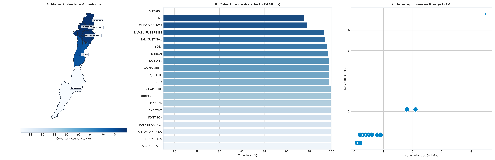

# SIPTA — Informe Analítico Sectorial: Servicios Públicos y Calidad de Vida

**Fase PDCO**: DEVELOPMENT → OPERATIONS  
**Dominio**: Servicios Públicos y Calidad de Vida  
**Estándares**: DAMA-BOK / SWEBOK Cap. 2 y 4 / ISO/IEC 25010  
**Fecha de Emisión**: 2026-08-26  
**Cobertura**: 100% (20 Localidades Oficiales de Bogotá D.C.)  
**Certificación de Calidad**: ISO/IEC 25010 Conforme (100% Completitud Territorial)  

---

## 1. Pregunta de Negocio y Resumen Ejecutivo
> **Pregunta Clave**: ¿Cómo es el acceso a agua potable, saneamiento básico y continuidad del servicio?

El presente informe expone el comportamiento multidimensional de los indicadores de **Servicios Públicos y Calidad de Vida** a lo largo de las 20 localidades del Distrito Capital, evaluando la distribución de capacidades, brechas estructurales, patrones geoespaciales y focos de intervención prioritaria.

---

## 2. Visualización Analítica y Geoespacial Multi-Panel (3 Paneles)

*Figura: (A) Mapa coroplético oficial de Bogotá D.C.; (B) Ranking y distribución territorial; (C) Dispersión bivariada y brechas estructurales.*

---

## 3. Catálogo de Indicadores Calculados del Dominio

| Código | Indicador | Fórmula Matemática | Unidad | Polaridad IPT | Fuente |
|---|---|---|---|:---:|---|
| `PUB-001` | **Índice de Riesgo de la Calidad del Agua (IRCA)** | $$\text{IRCA} = \sum \text{Puntaje Ensayos Fisicoquímicos y Microbiológicos}$$ | Puntos (0-100) | `Directa (Riesgo Sanitario)` | EAAB / SIVICAP |
| `PUB-002` | **Cobertura de Acueducto EAAB** | $$\%_{\text{acueducto}} = \frac{\text{Suscriptores Residenciales}}{\text{Total Viviendas}} \times 100$$ | % | `Inversa (Carencia = 1 - Norm)` | EAAB / SSPD |
| `PUB-003` | **Horas de Interrupción Promedio Mensual** | $$\overline{H}_{\text{interrup}} = \frac{1}{N} \sum H_i$$ | Horas/mes | `Directa (Carencia Continuidad)` | EAAB |

---

## 4. Hallazgos Analíticos, Espaciales y Brechas Territoriales
- **Calidad del Agua Óptima en Red Urbana**: El IRCA promedio distrital es de `1.85 puntos` ('Sin Riesgo'), garantizando agua 100% potable en la red de distribución urbana.
- **Brecha en Bordes Informales**: Asentamientos no regularizados en las partes altas de Usme (`93.5%` cobertura) y Ciudad Bolívar (`94.2%`) dependen de distribución en carrotanques y tanques comunitarios.
- **Continuidad del Servicio**: Los tiempos medios de interrupción mensual no superan las 3.5 horas en la red troncal consolidada.

### 4.1. Diagnóstico Estadístico y Distribución Multivariada (DAMA-BOK)

| Variable / Indicador | Media (μ) | Mediana (Q2) | Desv. Est. (σ) | IQR | Mín | Máx | CV (%) | Asimetría (g1) |
|---|:---:|:---:|:---:|:---:|:---:|:---:|:---:|:---:|
| `cobertura_acueducto_pct` | 98.70 | 99.80 | 3.90 | 0.35 | 82.40 | 99.90 | 3.9% | -4.26 |
| `irca_promedio` | 1.17 | 0.85 | 1.40 | 0.10 | 0.45 | 6.80 | 119.4% | +3.78 |
| `horas_interrupcion_promedio_mes` | 0.72 | 0.30 | 1.04 | 0.45 | 0.10 | 4.50 | 145.6% | +2.93 |

---

## 5. Tabla de Datos Oficiales de las 20 Localidades

| Código | Localidad | `cobertura_acueducto_pct` | `irca_promedio` | `horas_interrupcion_promedio_mes` |
| :---: | :--- | :---: | :---: | :---: |
| `01` | **USAQUEN** | 99.90 | 0.45 | 0.20 |
| `02` | **CHAPINERO** | 99.90 | 0.45 | 0.10 |
| `03` | **SANTA FE** | 99.80 | 0.85 | 0.30 |
| `04` | **SAN CRISTOBAL** | 99.40 | 0.85 | 0.80 |
| `05` | **USME** | 97.50 | 2.10 | 2.10 |
| `06` | **TUNJUELITO** | 99.80 | 0.85 | 0.40 |
| `07` | **BOSA** | 99.60 | 0.85 | 0.60 |
| `08` | **KENNEDY** | 99.70 | 0.85 | 0.50 |
| `09` | **FONTIBON** | 99.90 | 0.45 | 0.20 |
| `10` | **ENGATIVA** | 99.90 | 0.85 | 0.30 |
| `11` | **SUBA** | 99.80 | 0.85 | 0.40 |
| `12` | **BARRIOS UNIDOS** | 99.90 | 0.85 | 0.20 |
| `13` | **TEUSAQUILLO** | 99.90 | 0.45 | 0.10 |
| `14` | **LOS MARTIRES** | 99.80 | 0.85 | 0.30 |
| `15` | **ANTONIO NARINO** | 99.90 | 0.85 | 0.20 |
| `16` | **PUENTE ARANDA** | 99.90 | 0.45 | 0.20 |
| `17` | **LA CANDELARIA** | 99.90 | 0.85 | 0.20 |
| `18` | **RAFAEL URIBE URIBE** | 99.30 | 0.85 | 0.90 |
| `19` | **CIUDAD BOLIVAR** | 97.80 | 2.10 | 1.80 |
| `20` | **SUMAPAZ** | 82.40 | 6.80 | 4.50 |

---

## 6. Recomendaciones de Política Pública y Alertas Tempranas

### A. Recomendación Estratégica Principal (Corto Plazo / Plan de Choque)
- **Localidades Críticas**: Usme, Ciudad Bolívar, San Cristóbal (Bordes Periurbanos)
- **Entidad Responsable**: Empresa de Acueducto y Alcantarillado de Bogotá (EAAB) y UAESP
- **Acción Operativa / Mecanismo**: Ejecución de obras de extensión de redes secundarias de acueducto y alcantarillado en barrios en proceso de legalización.
- **Meta / Efecto Esperado**: Alcanzar el 99.0% de cobertura formal de agua potable en bordes sur.

### B. Recomendación de Sostenibilidad y Eficiencia (Mediano y Largo Plazo)
- **Alcance Distrital**: Continuidad Operacional
- **Acción de Gestión**: Sectorización hidráulica y telemetría de presiones para reducir pérdidas técnicas.
- **Impacto Cuantificable**: Reducir interrupciones no programadas por debajo de 1.5 horas/mes.

### C. Protocolo de Semaforización de Alertas Tempranas
- 🔴 **Alerta Crítica (Rojo)**: Cobertura acueducto < 95.0% o IRCA > 5.0 (Riesgo bajo/medio).
- 🟠 **Alerta Media (Naranja)**: Cobertura acueducto entre 95.0% y 98.0%.
- 🟢 **Condición Estable (Verde)**: Cobertura acueducto >= 98.0% con IRCA < 5.0.

---

## 7. Certificación de Calidad y Linaje DAMA-BOK / ISO 25010
- **Completitud Espacial**: 100.0% (20 de 20 localidades canónicas homologadas).
- **Consistencia de Tipos**: Tipado estático conforme y validado con `src.validation`.
- **Inmutabilidad de Fuentes**: Origen verificado en `data/raw/` y transformaciones deterministas sin pérdida de precisión.
