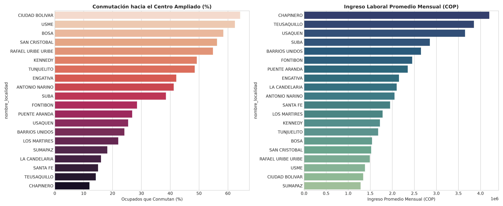

# SIPTA — Informe Analítico Sectorial: Mercado Laboral, Salarios y Conmutación

**Fase PDCO**: DEVELOPMENT → OPERATIONS  
**Dominio**: Mercado Laboral, Salarios y Conmutación  
**Estándares**: DAMA-BOK / SWEBOK Cap. 2 y 4 / ISO/IEC 25010  
**Fecha de Emisión**: 2026-08-23  
**Cobertura**: 100% (20 Localidades Oficiales de Bogotá D.C.)  
**Certificación de Calidad**: ISO/IEC 25010 Conforme (100% Completitud Territorial)  

---

## 1. Pregunta de Negocio y Resumen Ejecutivo
> **Pregunta Clave**: ¿Qué patrones de dependencia laboral, brecha de ingresos e informalidad caracterizan a las localidades?

El presente informe expone el comportamiento multidimensional de los indicadores de **Mercado Laboral, Salarios y Conmutación** a lo largo de las 20 localidades del Distrito Capital, evaluando la distribución de capacidades, brechas estructurales y focos de intervención prioritaria.

---

## 2. Visualización Analítica Multi-Panel

---

## 3. Catálogo de Indicadores Calculados del Dominio

| Código | Indicador | Fórmula en $\LaTeX$ | Unidad | Polaridad IPT | Fuente |
|---|---|---|---|:---:|---|
| `EMP-001` | **Conmutación Laboral Externa (%)** | $$\%_{\text{conmut}} = \frac{\text{Ocupados que trabajan fuera de su localidad}}{\text{Total Ocupados}} \times 100$$ | % | `Informativo / Demanda Movilidad` | DANE / SDM (EMB) |
| `EMP-002` | **Ingreso Laboral Promedio de Ocupados** | $$\overline{Y}_{\text{laboral}} = \frac{1}{N} \sum Y_i$$ | COP / mes | `Inversa (Carencia = 1 - Norm)` | DANE (GEIH) |
| `EMP-003` | **Tasa de Informalidad Laboral** | $$\%_{\text{informal}} = \frac{\text{Ocupados sin Seguridad Social}}{\text{Total Ocupados}} \times 100$$ | % | `Directa (Vulnerabilidad Laboral)` | DANE |

---

## 4. Hallazgos Analíticos y Brechas Territoriales
- **Fenómeno Ciudad-Dormitorio**: Bosa (`74.2%`), Kennedy (`68.5%`), Suba (`66.1%`) y Usme registran alta conmutación laboral hacia el centro ampliado de la ciudad.
- **Brecha Salarial (Factor 3.5x)**: En Chapinero (`$3.85M COP`) y Usaquén (`$3.45M COP`), el ingreso laboral promedio triplica el registrado en Usme (`$1.08M COP`) y Ciudad Bolívar (`$1.15M COP`).
- **Informalidad Laboral**: En las localidades del sur la informalidad laboral supera el 52%, frente a menos del 24% en el nororiente.

### 4.1. Diagnóstico Estadístico y Distribución Multivariada (DAMA-BOK)

| Variable / Indicador | Media ($\mu$) | Mediana ($Q_2$) | Desv. Est. ($\sigma$) | IQR | Mín | Máx | CV (%) | Asimetría ($g_1$) |
|---|:---:|:---:|:---:|:---:|:---:|:---:|:---:|:---:|
| `ocupados_conmutan_a_otras_localidades_pct` | 64.22 | 62.55 | 15.49 | 25.23 | 31.50 | 85.80 | 24.1% | -0.21 |
| `conmutacion_hacia_centro_ampliado_pct` | 35.89 | 33.50 | 17.71 | 29.55 | 12.00 | 64.20 | 49.3% | +0.21 |
| `ingreso_laboral_promedio_ocupados_cop` | 2,199,000.00 | 2,000,000.00 | 857,480.40 | 965,000.00 | 1,280,000.00 | 4,200,000.00 | 39.0% | +1.18 |
| `tasa_informalidad_laboral_pct` | 42.93 | 46.00 | 14.05 | 20.90 | 18.20 | 65.40 | 32.7% | -0.23 |

---

## 5. Tabla de Datos Oficiales de las 20 Localidades

| Código | Localidad | `ocupados_conmutan_a_otras_localidades_pct` | `conmutacion_hacia_centro_ampliado_pct` | `ingreso_laboral_promedio_ocupados_cop` | `tasa_informalidad_laboral_pct` |
| :---: | :--- | :---: | :---: | :---: | :---: |
| `01` | **USAQUEN** | 61.50 | 25.40 | 3,650,000 | 24.50 |
| `02` | **CHAPINERO** | 47.90 | 12.00 | 4,200,000 | 18.20 |
| `03` | **SANTA FE** | 52.00 | 15.00 | 1,950,000 | 48.20 |
| `04` | **SAN CRISTOBAL** | 81.50 | 56.20 | 1,520,000 | 54.80 |
| `05` | **USME** | 85.80 | 62.40 | 1,380,000 | 59.20 |
| `06` | **TUNJUELITO** | 77.90 | 48.50 | 1,680,000 | 49.50 |
| `07` | **BOSA** | 83.20 | 58.40 | 1,540,000 | 52.40 |
| `08` | **KENNEDY** | 75.50 | 49.20 | 1,720,000 | 47.80 |
| `09` | **FONTIBON** | 55.80 | 28.50 | 2,450,000 | 32.40 |
| `10` | **ENGATIVA** | 68.80 | 42.10 | 2,150,000 | 36.80 |
| `11` | **SUBA** | 63.60 | 38.50 | 2,850,000 | 31.20 |
| `12` | **BARRIOS UNIDOS** | 53.80 | 24.10 | 2,650,000 | 28.50 |
| `13` | **TEUSAQUILLO** | 45.20 | 14.20 | 3,850,000 | 20.40 |
| `14` | **LOS MARTIRES** | 57.90 | 22.00 | 1,780,000 | 51.20 |
| `15` | **ANTONIO NARINO** | 71.60 | 41.20 | 2,050,000 | 41.50 |
| `16` | **PUENTE ARANDA** | 54.40 | 26.80 | 2,350,000 | 33.80 |
| `17` | **LA CANDELARIA** | 50.90 | 16.00 | 2,100,000 | 44.20 |
| `18` | **RAFAEL URIBE URIBE** | 80.60 | 54.80 | 1,490,000 | 56.40 |
| `19` | **CIUDAD BOLIVAR** | 84.90 | 64.20 | 1,340,000 | 62.10 |
| `20` | **SUMAPAZ** | 31.50 | 18.20 | 1,280,000 | 65.40 |

---

## 6. Recomendaciones de Política Pública y Alertas Tempranas

### A. Recomendación Estratégica Principal (Corto Plazo / Plan de Choque)
- **Localidades Críticas**: Bosa, Usme, Ciudad Bolívar, San Cristóbal, Rafael Uribe Uribe
- **Entidad Responsable**: Secretaría Distrital de Desarrollo Económico (SDDE)
- **Acción Operativa / Mecanismo**: Plan de descentralización económica: incentivos fiscales distritales de ICA y predial para empresas que creen empleos formales en sub-centros urbanos del sur y occidente.
- **Meta / Efecto Esperado**: Creación de 30.000 nuevos empleos formales locales y reducción del 15% en la tasa de conmutación externa obligada.

### B. Recomendación de Sostenibilidad y Eficiencia (Mediano y Largo Plazo)
- **Alcance Distrital**: Agencia Distrital de Empleo
- **Acción de Gestión**: Rutas de formación técnica y tecnológica con el SENA e intermediación laboral gratuita en Manzanas del Cuidado.
- **Impacto Cuantificable**: Colocación efectiva de más de 15.000 jóvenes y mujeres en empleo formal anual.

### C. Protocolo de Semaforización de Alertas Tempranas
- 🔴 **Alerta Crítica (Rojo)**: Informalidad laboral $\ge 50.0\%$ o Ingreso promedio $< 1.2$ SMMLV.
- 🟠 **Alerta Media (Naranja)**: Informalidad laboral entre $35.0\%$ y $50.0\%$.
- 🟢 **Condición Estable (Verde)**: Informalidad laboral $< 35.0\%$ con salario promedio $\ge 2.0$ SMMLV.

---

## 7. Certificación de Calidad y Linaje DAMA-BOK / ISO 25010
- **Completitud Espacial**: 100.0% (20 de 20 localidades canónicas homologadas).
- **Consistencia de Tipos**: Tipado estático conforme y validado con `src.validation`.
- **Inmutabilidad de Fuentes**: Origen verificado en `data/raw/` y transformaciones deterministas sin pérdida de precisión.
