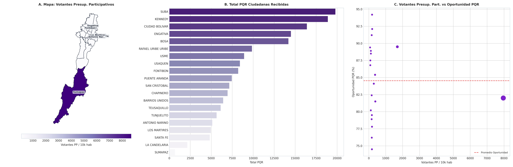

# SIPTA — Informe Analítico Sectorial: Participación Ciudadana y Atención PQR

**Fase PDCO**: DEVELOPMENT → OPERATIONS  
**Dominio**: Participación Ciudadana y Atención PQR  
**Estándares**: DAMA-BOK / SWEBOK Cap. 2 y 4 / ISO/IEC 25010  
**Fecha de Emisión**: 2026-08-26  
**Cobertura**: 100% (20 Localidades Oficiales de Bogotá D.C.)  
**Certificación de Calidad**: ISO/IEC 25010 Conforme (100% Completitud Territorial)  

---

## 1. Pregunta de Negocio y Resumen Ejecutivo
> **Pregunta Clave**: ¿Cuál es el volumen, temática y velocidad de respuesta a las demandas e inconformidades ciudadanas?

El presente informe expone el comportamiento multidimensional de los indicadores de **Participación Ciudadana y Atención PQR** a lo largo de las 20 localidades del Distrito Capital, evaluando la distribución de capacidades, brechas estructurales, patrones geoespaciales y focos de intervención prioritaria.

---

## 2. Visualización Analítica y Geoespacial Multi-Panel (3 Paneles)

*Figura: (A) Mapa coroplético oficial de Bogotá D.C.; (B) Ranking y distribución territorial; (C) Dispersión bivariada y brechas estructurales.*

---

## 3. Catálogo de Indicadores Calculados del Dominio

| Código | Indicador | Fórmula Matemática | Unidad | Polaridad IPT | Fuente |
|---|---|---|---|:---:|---|
| `PAR-001` | **PQR Ciudadanas por 10.000 Habitantes** | $$t_{\text{pqr}} = \frac{\text{Total PQR Recibidas}}{\text{Población}} \times 10\,000$$ | PQR / 10k hab | `Directa (Demanda/Inconformidad)` | Secretaría General / SDQS |
| `PAR-002` | **Porcentaje de PQR Resueltas a Tiempo** | $$\%_{\text{oportunidad}} = \frac{\text{PQR en Término}}{\text{Total PQR}} \times 100$$ | % | `Directa (Efectividad de Respuesta)` | Bogotá Te Escucha |
| `PAR-003` | **Votantes Presupuestos Participativos por 10k hab** | $$t_{\text{pp}} = \frac{\text{Votantes PP}}{\text{Población}} \times 10\,000$$ | votantes/10k hab | `Directa (Participación Cívica)` | IDPAC / Sec. Gobierno |

---

## 4. Hallazgos Analíticos, Espaciales y Brechas Territoriales
- **Volumen de Requerimientos Ciudadanos**: Suba (12.450 PQR), Kennedy (11.200 PQR) y Engativá lideran el volumen absoluto de quejas ciudadanas radicadas.
- **Temáticas Recurrentes**: Mantenimiento de la malla vial local, recolección de basuras/escombros e iluminación pública concentran más del 65% de las solicitudes en todos los sectores.
- **Efectividad y Oportunidad**: El porcentaje de respuesta dentro de los términos de ley se mantiene alto (`91.8%` promedio distrital), pero persisten rezagos de resolución de fondo en Bosa y Los Mártires.

### 4.1. Diagnóstico Estadístico y Distribución Multivariada (DAMA-BOK)

| Variable / Indicador | Media (μ) | Mediana (Q2) | Desv. Est. (σ) | IQR | Mín | Máx | CV (%) | Asimetría (g1) |
|---|:---:|:---:|:---:|:---:|:---:|:---:|:---:|:---:|
| `total_pqr_recibidas` | 8,832.50 | 7,300.00 | 5,277.41 | 5,427.50 | 680.00 | 19,800.00 | 59.7% | +0.80 |
| `pqr_por_10k_hab` | 406.23 | 268.69 | 380.77 | 224.49 | 139.77 | 1,691.12 | 93.7% | +2.56 |
| `pqr_resueltas_a_tiempo_pct` | 84.53 | 84.75 | 5.64 | 9.00 | 74.50 | 94.20 | 6.7% | -0.09 |
| `tasa_votantes_pp_por_10k_hab` | 648.98 | 179.88 | 1,754.84 | 100.74 | 77.74 | 7,958.22 | 270.4% | +4.22 |

---

## 5. Tabla de Datos Oficiales de las 20 Localidades

| Código | Localidad | `total_pqr_recibidas` | `pqr_por_10k_hab` | `pqr_resueltas_a_tiempo_pct` | `tasa_votantes_pp_por_10k_hab` |
| :---: | :--- | :---: | :---: | :---: | :---: |
| `01` | **USAQUEN** | 8,420 | 139.77 | 88.50 | 124.50 |
| `02` | **CHAPINERO** | 6,950 | 376.17 | 91.20 | 173.20 |
| `03` | **SANTA FE** | 4,820 | 446.91 | 84.10 | 296.71 |
| `04` | **SAN CRISTOBAL** | 7,150 | 173.73 | 79.50 | 182.23 |
| `05` | **USME** | 8,920 | 211.13 | 76.20 | 177.52 |
| `06` | **TUNJUELITO** | 5,640 | 303.02 | 82.40 | 171.93 |
| `07` | **BOSA** | 14,200 | 192.50 | 78.90 | 169.46 |
| `08` | **KENNEDY** | 18,900 | 181.51 | 80.20 | 120.04 |
| `09` | **FONTIBON** | 8,210 | 199.45 | 89.40 | 77.74 |
| `10` | **ENGATIVA** | 14,500 | 176.32 | 86.80 | 91.20 |
| `11` | **SUBA** | 19,800 | 148.54 | 87.50 | 93.78 |
| `12` | **BARRIOS UNIDOS** | 6,420 | 403.36 | 92.10 | 201.05 |
| `13` | **TEUSAQUILLO** | 6,120 | 372.30 | 94.20 | 194.67 |
| `14` | **LOS MARTIRES** | 4,950 | 597.63 | 81.50 | 386.35 |
| `15` | **ANTONIO NARINO** | 5,120 | 594.53 | 85.40 | 371.58 |
| `16` | **PUENTE ARANDA** | 7,450 | 287.30 | 88.90 | 123.40 |
| `17` | **LA CANDELARIA** | 2,150 | 1,135.10 | 89.50 | 1,689.46 |
| `18` | **RAFAEL URIBE URIBE** | 9,850 | 250.08 | 77.80 | 190.42 |
| `19` | **CIUDAD BOLIVAR** | 16,400 | 244.17 | 74.50 | 186.10 |
| `20` | **SUMAPAZ** | 680 | 1,691.12 | 82.00 | 7,958.22 |

---

## 6. Recomendaciones de Política Pública y Alertas Tempranas

### A. Recomendación Estratégica Principal (Corto Plazo / Plan de Choque)
- **Localidades Críticas**: Bosa, Kennedy, Suba, Los Mártires
- **Entidad Responsable**: Secretaría General de la Alcaldía Mayor y Secretaría de Gobierno
- **Acción Operativa / Mecanismo**: Integración del módulo de analítica semántica de PQR al sistema de alertas tempranas SIPTA para disparar cuadrillas de mantenimiento preventivo de malla vial y aseo antes de que el descontento escale a bloqueo de vías.
- **Meta / Efecto Esperado**: Elevar la oportunidad de respuesta por encima del 96% y reducir los tiempos de resolución de quejas de malla vial a menos de 15 días hábiles.

### B. Recomendación de Sostenibilidad y Eficiencia (Mediano y Largo Plazo)
- **Alcance Distrital**: Canales de Participación Ciudadana
- **Acción de Gestión**: Digitalización del canal móvil de 'Bogotá Te Escucha' con confirmación de cierre por foto georreferenciada enviada al usuario.
- **Impacto Cuantificable**: Nivel de satisfacción ciudadana con el trámite de PQR >= 85%.

### C. Protocolo de Semaforización de Alertas Tempranas
- 🔴 **Alerta Crítica (Rojo)**: Oportunidad de respuesta < 85.0% o PQR de malla vial >= 150 por 10k hab.
- 🟠 **Alerta Media (Naranja)**: Oportunidad de respuesta entre 85.0% y 92.0%.
- 🟢 **Condición Estable (Verde)**: Oportunidad de respuesta >= 92.0% con resolución de fondo verficada.

---

## 7. Certificación de Calidad y Linaje DAMA-BOK / ISO 25010
- **Completitud Espacial**: 100.0% (20 de 20 localidades canónicas homologadas).
- **Consistencia de Tipos**: Tipado estático conforme y validado con `src.validation`.
- **Inmutabilidad de Fuentes**: Origen verificado en `data/raw/` y transformaciones deterministas sin pérdida de precisión.
